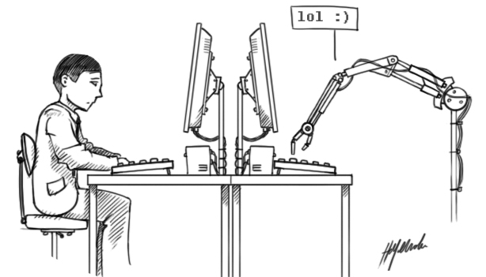
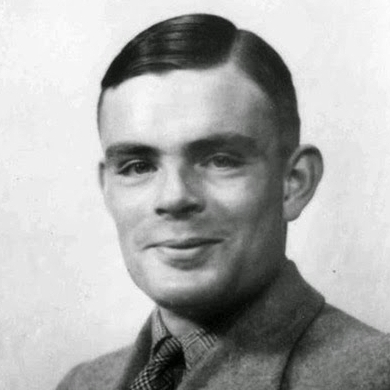
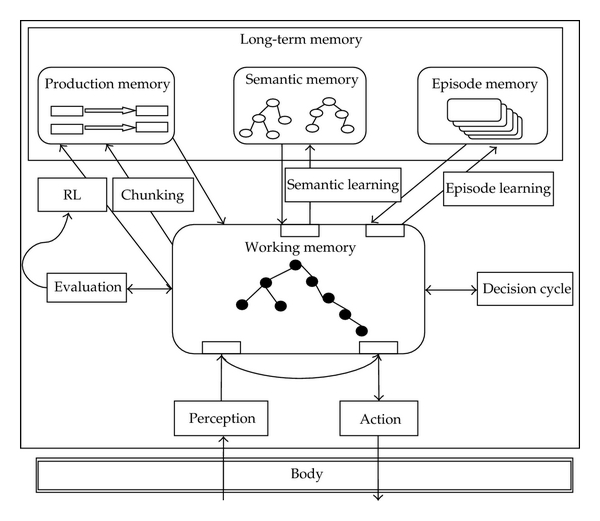
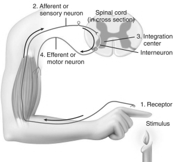

class: middle, center

# Introduction to Artificial Intelligence

Lecture 1: Foundations

---

class: middle, center

# Introduction

(Chapter 1)

---

# AI $\neq$ Science fiction

.gallery[


]

---

# What is AI?

Artificial intelligence is the science of making machines or programs that:

.grid.grid-half[
.col-1-2[

.center[Think like people]
]
.col-1-2[

.center[Think rationally]
]
]
.grid.grid-half[
.col-1-2[

.center[Act like people]
]
.col-1-2[

.center[Act rationally]
]
]

.footnote[Credits: UC Berkeley, [CS188](http://ai.berkeley.edu/lecture_slides.html)]

---

# Acting humanly

## The Turing test (the Imitation Game)

- A computer passes the test if a human
operator, after posing some written questions, cannot tell whether the written
responses come from a person or from a computer.

- *Operational* definition of intelligence.

.grid[
.col-2-3[

]
.col-1-3.center[

.caption[*Can machines think?* (Alan Turing, 1950).]
]
]

---

# Abilities for passing the test

An AI would not pass the Turing test without the following requirements:

- natural language processing
- knowledge representation
- automated reasoning
- machine learning
- computer vision (total Turing test)
- robotics (total Turing test

Despite being proposed almost 70 years ago, the Turing test is *still relevant* today.

---

# Limitations of the Turing test

- Tends to focus on human-like errors, linguistic tricks, etc.
- It seems more important to study the principles underlying intelligence than to replicate an exemplar.

.center[]
.caption[Aeronautics is not defined as the field of
making machines that fly so exactly like pigeons that they can fool even
other pigeons.]

---

# Thinking humanly

.grid[
.col-1-2[
## Cognitive science

- Cognitive science is the *study of the (human) mind* and its processes.
Its goal is to form a theory about the structure of the mind, summarized
*as a comprehensive computer model*.

- A cognitive architecture usually follows human-like
reasoning and can be used to produce testable predictions
(time of delays during problem solving, kinds of mistakes, learning rates, etc).
]
.col-1-2[

.caption[The modern SOAR cognitive architecture, as a descendant of the Logic Theorist (Alan Newell, Herbert Simon, 1956).]
]
]

---

# Limitations of cognition for AI

.grid[
.col-2-3[
- In linguistics, the argument of *poverty of the stimulus* states that children do not receive sufficient input to generalize grammatical rules
through linguistic input alone.

- Nativists claim that humans are born with a specific representational adaptation for language, i.e. biological prewiring.
]
.col-1-3.center[

.caption[*How do we know what we know?* (Noam Chomsky, 1980).]
]
]

Therefore, it may not be possible  (if true) to implement a fully functioning computer model of the mind
without the exact structure and content of this innate knowledge.

---

# Thinking rationally

## The logical approach

- The rational thinking approach is concerned with the study of irrefutable reasoning processes.
It ensures that all actions performed by a computer are formally *provable* from inputs and prior knowledge.

- The "laws of thought" were supposed to govern the operation of the mind.
Their study initiated the field of *logic* and the logicist tradition of AI  (1960-1990).

```prolog
/* Example of automated reasoning in Prolog */
mortal(X) :- human(X).
human(socrate).

?- mortal(socrate).
yes.
```

---

# Limitations of logical inference

- Representation of *informal* knowledge is difficult.
- Hard to define provable *plausible* reasoning.
- *Combinatorial explosion* (in time and space).
- Logical inference is part of intelligence. It does not cover everything:
    - e.g., might be no provably correct thing to do, but still something must be done;
    - e.g., reflex actions can be more successful than slower carefully deliberated ones.

.center[]
.caption[Pain withdrawal reflexes do not involve inference.]

---

# Acting rationally

- A *rational agent* acts so as to achieve the best (expected) outcome.
    - Correct logical inference is just one of several possible mechanisms for achieving this goal.
    - Perfect rationality cannot be achieved due to computational limitations!
      The amount of reasoning is adjusted according to available resources and importance of the result.
    - The brain is good at making rational decisions but not perfect either.
- Rationality only concerns *what* decisions are made (not the thought process behind them, human-like or not).
- Goals are expressed in terms of the *utility* of outcomes. Being rational means maximizing expected utility.
    - The standard of rationality is general and mathematically well defined.
- In this course, we will study general principles of rational agents and the components for constructing them.

---

class: middle

.center[

Artificial intelligence = Maximizing expected utility
]

.footnote[Credits: UC Berkeley, [CS188](http://ai.berkeley.edu/lecture_slides.html)]

---

# AI prehistory

- *Philosophy:* logic, methods of reasoning, mind as physical system, foundations of learning, language, rationality.
- *Mathematics:* formal representation and proof, algorithms, computation, (un)decidability, (in)tractability, probability.
- *Psychology:* adaptation, phenomena of perception and motor control, psychophysics.
- *Economics:* formal theory of rational decisions.
- *Linguistics:* knowledge representation, grammar.
- *Neuroscience:* plastic physical substrate for mental activity.
- *Control theory:* homeostatic systems, stability, simple optimal agent designs.

---

class: smaller

# A short history of AI

## 1940-1950: Early days
- 1943: McCulloch and Pitts: Boolean circuit model of the brain.
- 1950: Turing's "Computing machinery and intelligence:.

## 1950-1970: Excitement and expectations
- 1950s: Early AI programs, including Samuel's checkers program,
Newell and Simon's Logic Theorist and Gelernter's Geometry Engine.
- 1956: Dartmouth meeting: "Aritificial Intelligence" adopted.
- 1965: Robinson's complete algorithm for logical reasoning.
- 1966-1974: AI discovers computational complexity.

---

class: middle, center

<iframe width="560" height="315" src="https://www.youtube.com/embed/aygSMgK3BEM" frameborder="0" allowfullscreen></iframe>

---

class: smaller

# A short history of AI

## 1970-1990: Knowledge-based approaches
- 1966-1974: Neural network research almost dissappears.
- 1969-1979: Early development of knowledge-based systems.
- 1980-1988: Expert systems industrial boom.
- 1988-1993: Expert systems industry busts  (AI winter).

## 1990-Present: Statistical approaches
- 1985-1995: The return of neural networks.
- 1988-: Resurgence of probability, focus on uncertainty, general increase in technical depth.
- 1995-: Complete intelligent agents and learning systems (e.g, SOAR).
- 2000-: Availability of very large datasets.
- 2010-: Availability of fast commodity hardware (GPUs).
- 2012-: Resurgence of neural networks with of deep learning approaches.

---

# What can AI do at present?

- Translate spoken Chinese to spoken English, live?
- Answer multi choice questions, as good as an 8th grader?
- Converse with a person for an hour?
- Play decently at Chess? Go? Poker? Soccer?
- Buy groceries on the web? in a supermarket?
- Prove mathematical theorems?
- Drive a car safely on a parking lot? in New York?
- Perform a surgery?
- Identify skin cancer better than a dermatologist?
- Write a funny story?
- Paint like Vangogh? Compose music?
- Show common sense?

---

# Games

.grid[
.col-1-2.center[
<iframe width="280" height="200" src="https://www.youtube.com/embed/NJarxpYyoFI?&loop=1" frameborder="0" volume="0" allowfullscreen></iframe>
.caption[Deep Blue]
]
.col-1-2.center[
<iframe width="280" height="200" src="https://www.youtube.com/embed/V1eYniJ0Rnk?&loop=1&start=25" frameborder="0" volume="0" allowfullscreen></iframe>
.caption[Playing Atari games]
]
]
.grid[
.col-1-2.center[
<iframe width="280" height="200" src="https://www.youtube.com/embed/g-dKXOlsf98?&loop=1" frameborder="0" volume="0" allowfullscreen></iframe>
.caption[Alpha Go]
]
.col-1-2.center[
<iframe width="280" height="200" src="https://www.youtube.com/embed/naBLXWb60gQ?&loop=1" frameborder="0" volume="0" allowfullscreen></iframe>
.caption[Starcraft]
]
]

---

# Natural language

.grid[
.col-1-2.center[
<iframe width="280" height="200" src="https://www.youtube.com/embed/Nu-nlQqFCKg?&loop=1" frameborder="0" volume="0" allowfullscreen></iframe>
.caption[Speech translation and synthesis]
]
.col-1-2.center[
<iframe width="280" height="200" src="https://www.youtube.com/embed/heVE_me5VaQ?&loop=1" frameborder="0" volume="0" allowfullscreen></iframe>
.caption[Question answering systems]
]
]

---

# Vision

.grid[
.col-1-2.center[
<iframe width="280" height="200" src="https://www.youtube.com/embed/cm2VlEGNz5A?&loop=1" frameborder="0" volume="0" allowfullscreen></iframe>
.caption[Semantic segmentation]
]
.col-1-2.center[
<iframe width="280" height="200" src="https://www.youtube.com/embed/8BFzu9m52sc?&loop=1" frameborder="0" volume="0" allowfullscreen></iframe>
.caption[Generating image descriptions]
]
]
.grid[
.col-1-2.center[
<iframe width="280" height="200" src="https://www.youtube.com/embed/pW6nZXeWlGM?&loop=1" frameborder="0" volume="0" allowfullscreen></iframe>
.caption[Pose estimation]
]
.col-1-2.center[
<iframe width="280" height="200" src="https://www.youtube.com/embed/IvmLEq9piJ4?&loop=1" frameborder="0" volume="0" allowfullscreen></iframe>
.caption[Detecting skin cancer]
]
]

---

# Robotics

.grid[
.col-1-2.center[
<iframe width="280" height="200" src="https://www.youtube.com/embed/-96BEoXJMs0?&loop=1" frameborder="0" volume="0" allowfullscreen></iframe>
.caption[Automous cars]
]
.col-1-2.center[
<iframe width="280" height="200" src="https://www.youtube.com/embed/NFNEOooEQX4?&loop=1&start=80" frameborder="0" volume="0" allowfullscreen></iframe>
.caption[Playing soccer]
]
]
.grid[
.col-1-2.center[
<iframe width="280" height="200" src="https://www.youtube.com/embed/gn4nRCC9TwQ?&loop=1" frameborder="0" volume="0" allowfullscreen></iframe>
.caption[Learning to walk]
]
.col-1-2.center[
<iframe width="280" height="200" src="https://www.youtube.com/embed/gy5g33S0Gzo?&loop=1" frameborder="0" volume="0" allowfullscreen></iframe>
.caption[Folding laundry]
]
]

---

# Logic

.grid[
.col-1-2.center[

.caption[Automated Theorem Prover]
]
.col-1-2.center[

.caption[Formal software verification]
]
]

---

# Decision making

.grid[
.col-1-2.center[
<iframe width="280" height="200" src="https://www.youtube.com/embed/BNHR6IQJGZs?&loop=1" frameborder="0" volume="0" allowfullscreen></iframe>
.caption[Search engines]
]
.col-1-2.center[
<iframe width="280" height="200" src="https://www.youtube.com/embed/AuwayMjvuT0?&loop=1&start=35" frameborder="0" volume="0" allowfullscreen></iframe>
.caption[Fraud detection]
]
]
.grid[
.col-1-2.center[
<iframe width="280" height="200" src="https://www.youtube.com/embed/S4RL6prqtGQ?&loop=1" frameborder="0" volume="0" allowfullscreen></iframe>
.caption[Recommendation systems]
]
.col-1-2.center[
<iframe width="280" height="200" src="https://www.youtube.com/embed/_QndP_PCRSw?&loop=1" frameborder="0" volume="0" allowfullscreen></iframe>
.caption[Sorting packages (routing, planning)]
]
]

---

class: center, middle

... and many more applications of AI techniques!

But how do these works? How far are we from general AI?

---

class: middle, center

# Intelligent agents

(Chapter 2)

---

# Agents and environments

---

# Pacman example
# Terminator example

---

# Rational agents

- An agent is an entity that *perceives* and *acts*.
- A *rational agent* selects actions that maximize its (expected) utility.
- Characteristics of the percepts, environment and action space dictate techniques
for selecting rational actions.

---

# References

- Turing, Alan M. "Computing machinery and intelligence." Mind 59.236 (1950): 433-460.
- Newell, Allen, and Herbert Simon. "The logic theory machine--A complex information processing system." IRE Transactions on information theory 2.3 (1956): 61-79.
- Chomsky, Noam. "Rules and representations." Behavioral and brain sciences 3.1 (1980): 1-15.
