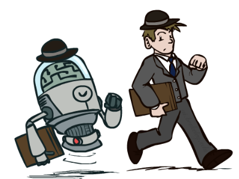
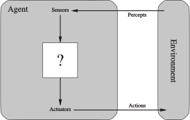
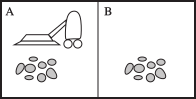
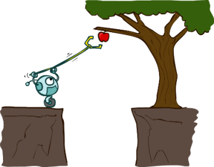
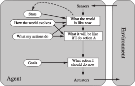

class: middle, center, title-slide

# Introduction to Artificial Intelligence

Lecture 1: Foundations

<br><br>
Prof. Gilles Louppe<br>
[g.louppe@uliege.be](g.louppe@uliege.be)

???

R: go over the Intelligent agents part, formalize a bit more.

---

class: middle

# Introduction

---

class: middle, center

.width-70[]

"With artificial intelligence we are summoning the demon" -- Elon Musk

---

class: middle, center

.width-60[]

"We're really closer to a smart washing machine than Terminator" -- Fei-Fei Li, Director of Stanford AI Lab.

---

# What is AI?

--

count: false

Artificial intelligence is the science of making machines or programs that:
.center.grid[
.kol-1-4[]
.kol-1-4[
.caption[Think like people]
.width-100[]
]
.kol-1-4[
.caption[Think rationally]
.width-100[]
]
]
.grid[
.kol-1-4[]
.kol-1-4[
.caption[Act like people]
.width-100[]
]
.kol-1-4[
.caption[Act rationally]
.width-100[]
]
]

.footnote[Credits: [CS188](http://ai.berkeley.edu/lecture_slides.html), UC Berkeley.]

---

# Acting humanly

## The Turing test

A computer passes the **Turing test** (also known as the Imitation Game) if a human operator, after posing some written
questions, cannot tell whether the written responses come from a person or from
a computer.

.grid[
.kol-2-3[
.width-100[]
]
.kol-1-3.center[
.width-100.circle[]
.caption[Can machines think?<br> (Alan Turing, 1950)]
]
]

???

- The Turing test is an *operational* definition of intelligence.

---

class: middle

An agent would not pass the Turing test without the following **requirements**:

- natural language processing
- knowledge representation
- automated reasoning
- machine learning
- computer vision (total Turing test)
- robotics (total Turing test)

Despite being proposed almost 70 years ago, the Turing test is *still relevant*
today.

---

class: middle

## Limitations of the Turing test

The Turing test tends to focus on *human-like errors*, *linguistic tricks*, etc.

However, it seems more important to study the **principles** underlying intelligence than to replicate an exemplar.

<br>
.center.width-70[]
.caption[Aeronautics is not defined as the field of making machines<br> that fly
so exactly like pigeons that they can fool even other pigeons.]

---

# Thinking humanly


**Cognitive science** is the study of the *human mind* and its processes. The goal of cognitive science
  is to form a theory about the structure of the mind, summarized as a comprehensive **computer
  model**.

A *cognitive architecture* usually follows human-like reasoning and can be used to
produce testable predictions (time of delays during problem solving, kinds of
mistakes, learning rates, etc).

---

class: middle, center

.width-80[]

.caption[The modern SOAR cognitive architecture, as a descendant of the Logic Theorist<br>(Alan Newell, Herbert Simon, 1956).]

---

class: middle

## Limitations of cognition for AI

.grid[
.kol-2-3[
- In linguistics, the argument of **poverty of the stimulus** states that children
do not receive sufficient input to generalize grammatical rules through
linguistic input alone.
    - A baby hears too few sentences to deduce the grammar of English before he speaks correctly.

- (Controversial) Therefore, humans must be *biologically pre-wired*
with **innate knowledge** for representing language.
]
.kol-1-3.center[
.circle.width-100[]
.caption[How do we know what we know? (Noam Chomsky, 1980)]
]
]

Therefore, it may not be possible to implement a fully functioning
computer model of the human mind without background knowledge of some sort.
This is a huge technical **obstacle**, as accessing
this knowledge would require reverse-engineering the brain.

---

# Thinking rationally

## The logical approach

- The rational thinking approach is concerned with the study of *irrefutable
reasoning processes*. It ensures that all actions performed by a computer are
formally **provable** from inputs and prior knowledge.

- The "laws of thought" were supposed to govern the operation of the mind.
Their study initiated the field of *logic* and the *logicist tradition* of AI
(1960-1990).

---

class: middle

## The Zebra puzzle

.grid[
.kol-1-2[
- There are five houses.
- The English man lives in the red house.
- The Swede has a dog.
- The Dane drinks tea.
- The green house is immediately to the left of the white house.
- They drink coffee in the green house.
- The man who smokes Pall Mall has birds.
- In the yellow house they smoke Dunhill.
- In the middle house they drink milk.
]
.kol-1-2[
- The Norwegian lives in the first house.
- The man who smokes Blend lives in the house next to the house with cats.
- In a house next to the house where they have a horse, they smoke Dunhill.
- The man who smokes Blue Master drinks beer.
- The German smokes Prince.
- The Norwegian lives next to the blue house.
- They drink water in a house next to the house where they smoke Blend.
]
]

---

class: middle, center

Who owns the zebra?

---

class: middle

```prolog
select([A|As],S):- select(A,S,S1),select(As,S1).
select([],_).

next_to(A,B,C):- left_of(A,B,C) ; left_of(B,A,C).
left_of(A,B,C):- append(_,[A,B|_],C).

zebra(Owns, HS):-  % color,nation,pet,drink,smokes
      HS =    [ h(_,norwegian,_,_,_), _,  h(_,_,_,milk,_), _, _],
      select( [ h(red,englishman,_,_,_),  h(_,swede,dog,_,_),
                h(_,dane,_,tea,_),        h(_,german,_,_,prince) ], HS),
      select( [ h(_,_,birds,_,pallmall),  h(yellow,_,_,_,dunhill),
                h(_,_,_,beer,bluemaster) ],                         HS),
      left_of(  h(green,_,_,coffee,_),    h(white,_,_,_,_),         HS),
      next_to(  h(_,_,_,_,dunhill),       h(_,_,horse,_,_),         HS),
      next_to(  h(_,_,_,_,blend),         h(_,_,cats, _,_),         HS),
      next_to(  h(_,_,_,_,blend),         h(_,_,_,water,_),         HS),
      next_to(  h(_,norwegian,_,_,_),     h(blue,_,_,_,_),          HS),
      member(   h(_,Owns,zebra,_,_), HS).

:- ?- time(( zebra(Who, HS), maplist(writeln,HS), nl, write(Who), nl, nl, fail
             ; write('No more solutions.') )).
```

---

class: middle

Output =
```prolog
h(yellow,norwegian, cats,  water, dunhill)
h(blue,  dane,      horse, tea,   blend)
h(red,   englishman,birds, milk,  pallmall)
h(green, german,    zebra, coffee,prince)
h(white, swede,     dog,   beer,  bluemaster)

german

No more solutions.
% 5,959 inferences, 0.000 CPU in 0.060 seconds (0% CPU, Infinite Lips)
```

---

class: middle

## Limitations of logical inference

- Representation of *informal* knowledge is difficult.
- Hard to define provable *plausible* reasoning.
- *Combinatorial explosion* (in time and space).
- Logical inference is part of intelligence. It does not cover everything:
    - e.g., might be no provably correct thing to do, but still something must be done;
    - e.g., reflex actions can be more successful than slower carefully deliberated ones.

.center[]
.caption[Pain withdrawal reflexes do not involve inference.]

---

# Acting rationally

A **rational agent** acts so as to achieve the best (expected) outcome.
- Correct logical inference is just one of several possible mechanisms for achieving this goal.
- Perfect rationality cannot be achieved due to computational limitations!
  The amount of reasoning is adjusted according to available resources and importance of the result.
- The brain is good at making rational decisions but not perfect either.

Rationality only concerns *what* decisions are made (not the thought process behind them, human-like or not).

Goals are expressed in terms of the **performance** or **utility** of outcomes. Being rational means maximizing its expected performance.
The standard of rationality is general and mathematically well defined.

---

class: middle

.center[

In this course, Artificial intelligence = **Maximizing expected performance**
]

.footnote[Credits: [CS188](http://ai.berkeley.edu/lecture_slides.html), UC Berkeley.]

---

# AI prehistory

- *Philosophy:* logic, methods of reasoning, mind as physical system, foundations of learning, language, rationality.
- *Mathematics:* formal representation and proof, algorithms, computation, (un)decidability, (in)tractability, probability.
- *Psychology:* adaptation, phenomena of perception and motor control, psychophysics.
- *Economics:* formal theory of rational decisions.
- *Linguistics:* knowledge representation, grammar.
- *Neuroscience:* plastic physical substrate for mental activity.
- *Control theory:* homeostatic systems, stability, simple optimal agent designs.

---

# A short history of AI

## 1940-1950: Early days
- 1943: McCulloch and Pitts: Boolean circuit model of the brain.
- 1950: Turing's "Computing machinery and intelligence:.

## 1950-1970: Excitement and expectations
- 1950s: Early AI programs, including Samuel's checkers program,
Newell and Simon's Logic Theorist and Gelernter's Geometry Engine.
- 1956: Dartmouth meeting: "Aritificial Intelligence" adopted.
- 1958: Rosenblatt invents the perceptron.
- 1965: Robinson's complete algorithm for logical reasoning.
- 1966-1974: AI discovers computational complexity.

---

class: middle, center, black-slide

<iframe width="600" height="450" src="https://www.youtube.com/embed/aygSMgK3BEM" frameborder="0" allowfullscreen></iframe>

---

class: middle

## 1970-1990: Knowledge-based approaches
- 1969: Neural network research almost disappears after Minsky and Paper's paper.
- 1969-1979: Early development of knowledge-based systems.
- 1980-1988: Expert systems industrial boom.
- 1988-1993: Expert systems industry busts  (AI winter).

## 1990-Present: Statistical approaches
- 1985-1995: The return of neural networks.
- 1988-: Resurgence of probability, focus on uncertainty, general increase in technical depth.
- 1995-2010: New fade of neural networks.
- 1995-: Complete intelligent agents and learning systems.
- 2000-: Availability of very large datasets.
- 2010-: Availability of fast commodity hardware (GPUs).
- 2012-: Resurgence of neural networks with  deep learning approaches.

---

# What can AI do at present?

- Translate spoken Chinese to spoken English, live?
- Answer multi choice questions, as good as an 8th grader?
- Converse with a person for an hour?
- Play decently at Chess? Go? Poker? Soccer?
- Buy groceries on the web? in a supermarket?
- Prove mathematical theorems?
- Drive a car safely on a parking lot? in New York?
- Perform a surgery?
- Identify skin cancer better than a dermatologist?
- Write a funny story?
- Paint like Vangogh? Compose music?
- Show common sense?

---

class: middle, center, black-slide

<iframe width="600" height="450" src="https://www.youtube.com/embed/V1eYniJ0Rnk" frameborder="0" allowfullscreen></iframe>

Playing Atari games

---

class: middle, center, black-slide

<iframe width="600" height="450" src="https://www.youtube.com/embed/g-dKXOlsf98" frameborder="0" allowfullscreen></iframe>

Beat the best human Go players

---

class: middle, center, black-slide

<iframe width="600" height="450" src="https://www.youtube.com/embed/eHipy_j29Xw" frameborder="0" allowfullscreen></iframe>

Beat teams of human players at real-time strategy games (Dota 2)

---

class: middle, center, black-slide

<iframe width="600" height="450" src="https://www.youtube.com/embed/Nu-nlQqFCKg" frameborder="0" allowfullscreen></iframe>

Speech translation and synthesis

---

class: middle, center, black-slide

<iframe width="600" height="450" src="https://www.youtube.com/embed/qWl9idsCuLQ" frameborder="0" allowfullscreen></iframe>

Semantic segmentation

---

class: middle, center, black-slide

<iframe width="600" height="450" src="https://www.youtube.com/embed/8BFzu9m52sc" frameborder="0" allowfullscreen></iframe>

Generating image descriptions

---

class: middle, center, black-slide

<iframe width="600" height="450" src="https://www.youtube.com/embed/IvmLEq9piJ4" frameborder="0" allowfullscreen></iframe>

Detecting skin cancer

---

class: middle, center, black-slide

<iframe width="600" height="450" src="https://www.youtube.com/embed/gn4nRCC9TwQ" frameborder="0" allowfullscreen></iframe>

Learning to walk

---

class: middle, center, black-slide

<iframe width="600" height="450" src="https://www.youtube.com/embed/gy5g33S0Gzo" frameborder="0" allowfullscreen></iframe>

Folding laundry

---

class: middle, center, black-slide

<iframe width="600" height="450" src="https://www.youtube.com/embed/yyLa6xIK9Qs" frameborder="0" allowfullscreen></iframe>

Playing soccer

---

class: middle, center, black-slide

<iframe width="600" height="450" src="https://www.youtube.com/embed/-96BEoXJMs0" frameborder="0" allowfullscreen></iframe>

Driving a car

---

class: middle, center, black-slide

<iframe width="600" height="450" src="https://www.youtube.com/embed/hYZM5l0G28I" frameborder="0" allowfullscreen></iframe>

Learning to sort waste (Norman Marlier, ULiège, 2018)

---

count: false
class: middle, center, black-slide

<iframe width="600" height="450" src="https://www.youtube.com/embed/MsuS0gaSHJ0" frameborder="0" allowfullscreen></iframe>

Learning to sort waste (Norman Marlier, ULiège, 2018)

---

# What is missing?

Intelligence is not just about **pattern recognition**, which is something most of these works are based on.

It is about *modeling the world*:
- explaining and understanding what we see;
- imagining things we could see but haven't yet;
- problem solving and planning actions to make these things real;
- building new models as we learn more about the world.

---

class: middle

# Intelligent agents

---

# Agents and environments

<br><br>
.width-80.center[]

---

class: middle

## Agents

- An **agent** is an entity that *perceives* its environment through sensors and
  take *actions* through actuators.

- The agent behavior is described by the **agent function**, or **policy**, that
  maps percept histories to actions:
  $$f : \mathcal{P}^* \to \mathcal{A}$$

- The **agent program** runs on the physical architecture to produce $f$.

---

class: middle

## Vacuum-cleaner world

.width-60.center[]

- Percepts: location and content, e.g. $[A, Dirty]$
- Actions: $Left, Right, Suck, NoOp$

---

class: middle

## A vacuum-cleaner agent

Partial tabulation of a simple vacuum-cleaner agent function:

| Percept sequence | Action |
| ---------------- | ------ |
| $[A, Clean]$     | $Right$ |
| $[A, Dirty]$     | $Suck$ |
| $[B, Clean]$     | $Left$ |
| $[A, Dirty]$     | $Suck$ |
| $[A, Clean], [A, Clean]$     | $Right$ |
| $[A, Clean], [A, Dirty]$     | $Suck$ |
| (...) | (...) |

---

class: middle

## The optimal vacuum-cleaner?

What is the **right** agent function?

How to formulate the *goal* of the vacuum-cleaner agent?
- 1 point per square cleaned up at time $t$?
- 1 point per clean square per time step, minus one per move?
- penalize for $>k$ dirty squares?

Can it be implemented in a *small* agent program?

---

# Rational agents

- Informally, a *rational agent* is an agent that does the "right thing".
- A **performance measure** evaluates a sequence of environment
  states caused by the agent's behavior.
- A rational agent is an agent that chooses whichever action that **maximizes** the
  *expected* value of the performance measure, given the percept sequence to date.

.center[]

.footnote[Credits: [CS188](http://ai.berkeley.edu/lecture_slides.html), UC Berkeley.]

---

class: middle

- Rationality $\neq$ omniscience    
    - percepts may not supply all relevant information.
- Rationality $\neq$ clairvoyance
    - action outcomes may not be as expected.
- Hence, rational $\neq$ successful.
- However, rationality leads to *exploration*, *learning* and *autonomy*.

---

# Performance, environment, actuators, sensors

The characteristics of the performance measure, environment, action space and
percepts dictate techniques for selecting rational actions.

These characteristics are summarized as the **task environment**.

## Example 1: an autonomous car
- *performance measure*: safety, destination, legality, comfort, ...
- *environment*: streets, highways, traffic, pedestrians, weather, ...
- *actuators*: steering, accelerator, brake, horn, speaker, display, ...
- *sensors*: video, accelerometers, gauges, engine sensors, GPS, ...

---

class: middle

## Example 2: an Internet shopping agent
- *performance measure*: price, quality, appropriateness, efficiency
- *environment*: current and future WWW sites, vendors, shippers
- *actuators*: display to user, follow URL, fill in form, ...
- *sensors*: web pages (text, graphics, scripts)

---

# Environment types

- *Fully observable* vs. **partially observable**
    - Whether the agent sensors give access to the complete state of the environment, at each point in time.
- *Deterministic* vs. **stochastic**
    - Whether the next state of the environment is completely determined by the current state and the action executed by the agent.
- *Episodic* vs. **sequential**
    - Whether the agent's experience is divided into atomic independent episodes.
- *Static* vs. **dynamic**
    - Whether the environment can change, or the performance measure can change with time.
- *Discrete* vs. **continuous**
    - Whether the state of the environment, the time, the percepts or the actions are continuous.
- *Single agent* vs. **multi-agent**
    - Whether the environment include several agents that may interact which each other.
- *Known* vs **unknown**
    - Reflects the agent's state of knowledge of the "law of physics" of the environment.

---

class: middle

Are the following task environments fully observable? deterministic? episodic?
static? discrete? single agents? Known?

- Crossword puzzle
- Chess, with a clock
- Poker
- Backgammon
- Taxi driving
- Medical diagnosis
- Image analysis
- Part-picking robot
- Refinery controller
- The real world

---

# Agent programs

The job of AI is to design an **agent program** that implements the agent
function. This program will run on an *architecture*, that is a computing device
with physical sensors and actuators.

$$agent = program + architecture$$

## Implementation

Agent programs can be designed and implemented in many ways:

- with tables
- with rules
- with search algorithms
- with learning algorithms

---

# Table-driven agents

- A *table-driven agent* determines its next action with a table that contains the appropriate action for every possible percept sequence.
- **Design issue:** one needs to anticipate all sequence of percepts and how the agent should respond.
- **Technical issue:** the lookup table will contain $\sum_{t=1}^T |\mathcal{P}|^t$ entries.
    - Example (autonomous car): using a 30fps 640x480 RBG camera as sensor, this results in a table with over $10^{250000000000}$ entries for an hour of driving.

---

# Simple reflex agents

<br><br>
.center.width-80[]


---

class: middle
- *Simple reflex agents* select actions on the basis of the current percept,
  ignoring the rest of the percept history.
- They implement **condition-action rules** that match the
  current percept to an action.
- Rules provide a way to *compress* the function table.
    - Example (autonomous car): If a car in front of you slow down, you should break.
      The color and model of the car, the music on the radio or the weather are all irrelevant.
- Simple reflex agents are simple but they turn out to have **limited intelligence**.
- They can only work in a *Markovian* environment, that is if the correct
  decision can be made on the basis of only the current percept.
  In other words, if the environment is fully observable.

---

# Model-based reflex agents

<br><br>
.center.width-80[]

---

class: middle

- *Model-based agents* handle partial observability of the environment by
  keeping track of the part of the world they cannot see now.

- The internal state of model-based agents is updated on the basis of a **model** which determines:
    - how the environment evolves independently of the agent;
    - how the agent actions affect the world.

---

# Goal-based agents

<br><br>
.center.width-80[]

---

class: middle

- Principle: i) generate possible sequences of actions, ii) predict the
  resulting states and  iii) assess **goals** in each.
    - Example (autonomous car): Has the car arrived to destination?
- A *goal-based agent* chooses an action that will achieve the goal.
    - More general than rules. Goals are rarely explicit in condition-action rules.
    - Finding action sequences that achieve goals is difficult.
      *Search* and *planning* are two strategies.

---

# Utility-based agents

<br><br>
.center.width-80[]

---

class: middle

- *Goals* are often not enough to generate high-quality behavior.
    - Example (autonomous car): There are many ways to arrive to destination, but some are quicker or more reliable.
    - Goals only provide binary assessment of performance.
- A **utility function** scores any given sequence of environment states.
    - The utility function is an internalization of the performance measure.
- A rational utility-based agent chooses an action that **maximizes the expected utility of its outcomes**.

---

# Learning agents

<br><br>
.center.width-80[]

---

class: middle

- *Learning agents* are capable of **self-improvement**. They can become more
  competent than their initial knowledge alone might allow.
- They can make changes to any of the knowledge components by:
    - learning how the *world* evolves;
    - learning what are the *consequences* of actions;
    - learning the utility of actions through *rewards*.

---

class: middle

## A learning autonomous car

- *Performance element*:
    - The current system for selecting actions and driving.
- The *critic* observes the world and passes information to the *learning element*.
    - E.g., the car makes a quick left turn across three lanes of traffic. The critic observes shocking language from the other drivers and informs bad action.
    - The learning element tries to modifies the performance element to avoid reproducing this situation in the future.
- The *problem generator* identifies certain areas of behavior in need of improvement and suggest experiments.
    - E.g., trying out the brakes on different surfaces in different weather conditions.

---

# Summary

- An **agent** is an entity that perceives and acts in an environment.
- The *performance measure* evaluates the agent's behavior. **Rational agents** act so as to maximize the expected value of the performance measure.
- *Task environments* includes performance measure, environment, actuators and sensors. They can vary along several significant dimensions.
- The **agent program** effectively implements the agent function. Their designs are dictated by the task environment.
- *Simple reflex agents* respond directly to percepts, whereas *model-based reflex agents* maintain internal state to track the world. *Goal-based agents* act to achieve goals while **utility-based agents** try to maximize their expected performance.
- All agents can improve their performance through **learning**.

---

class: end-slide, center
count: false

The end.

---

# References

- Turing, Alan M. "Computing machinery and intelligence." Mind 59.236 (1950): 433-460.
- Newell, Allen, and Herbert Simon. "The logic theory machine--A complex information processing system." IRE Transactions on information theory 2.3 (1956): 61-79.
- Chomsky, Noam. "Rules and representations." Behavioral and brain sciences 3.1 (1980): 1-15.
