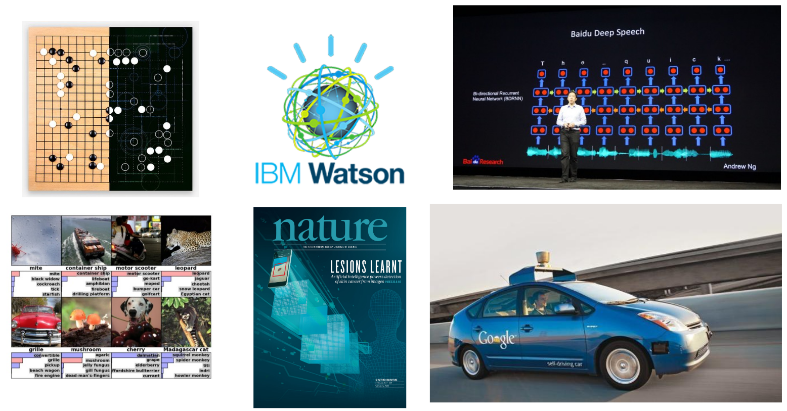
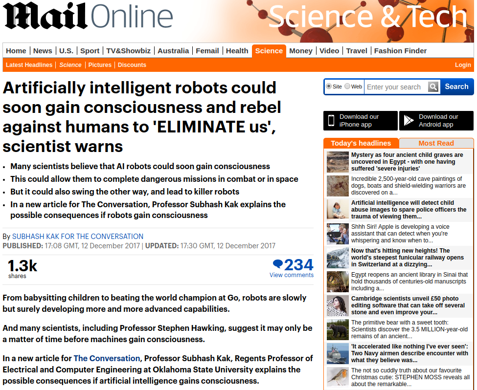
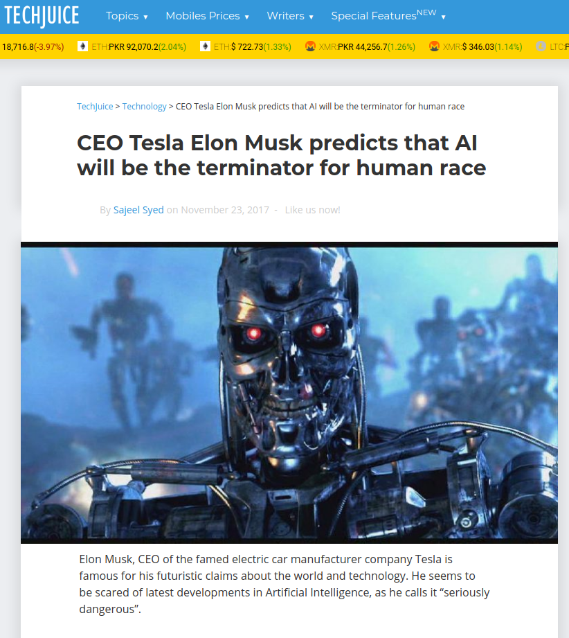

class: middle, center, title-slide

# Introduction to Artificial Intelligence

Lecture 10: Artificial General Intelligence

???

https://futureoflife.org/wp-content/uploads/2017/01/Jurgen-Schmidhuber.pdf?x56934

---

# From technological breakthroughs...

.center.width-100[]

---

# ... to popular media

.grid[
.col-1-4[]
.col-1-4[]
.col-1-4[]
.col-1-4[]
]
.grid[
.col-1-4[]
.col-1-4[]
.col-1-4[]
.col-1-4[]
]
.grid[
.col-1-4[]
.col-1-4[]
.col-1-4[]
.col-1-4[]
]

---

# Artificial narrow intelligence

- Artificial intelligence today is still very **narrow**.
    - Modern AI systems often reach super-human level performance.
    - ... but only at *very specific problems*!
    - They **do not generalize** to the real world nor to arbitrary tasks.

---

# AlphaGo

**Convenient** properties of AlphaGo:
- *Deterministic* (no noise in the game).
- *Fully observed* (each player has complete information)
- *Discrete action space* (finite number of actions possible)
- *Perfect simulator* (the effect of any action is known exactly)
- *Short episodes* (200 actions per game)
- *Clear and fast evaluation* (as stated by Go rules)
- *Huge dataset available* (games)

.center.width-40[]

---

class: smaller

# Picking challenge

.center.width-100[]

.center[Can we run AlphaGo on a robot for the Amazon Picking Challenge?]

---

class: smaller

# Picking challenge

.center.width-100[]

- *Deterministic*: OK
- *Fully observed*: **OKish**
- *Discrete action space*: OK
- *Perfect simulator*: **TROUBLE**
- *Short episodes*: **challenge**
- *Clear and fast evaluation*: not good
- *Huge dataset available*: **challenge**

---

# Artificial general intelligence

XXX

---

# Singularity

Irving John Good (1965):

- Let an **ultraintelligent** machine be defined as a machine that can far surpass all the intellectual activities of any man however clever.
- Since the design of machines is one of these intellectual activities, an ultraintelligent machine could *design even better machines*.
- There would then unquestionably be an **'intelligence explosion'**, and the intelligence of man would be left far behind.
- Thus the first ultraintelligent machine is the *last invention* that man need ever make, provided that the machine is docile enough to tell us how to keep it under control.

---

# When computers get smarter than we are

.center[
<iframe width="640" height="420" src="https://www.youtube.com/embed/MnT1xgZgkpk?&loop=1&start=0" frameborder="0" volume="0" allowfullscreen></iframe>
]

---

# How to build AGI?

Several working **hypothesis**:
- *Supervised learning*: "It works, just scale up!"
- *Unsupervised learning*: "It will work, if we only scale up!"
- *Brain simulation*: "This will work one day, right?"
- *AIXI*: "Guys, I can write down optimal AI."
- *Artificial life*: "Let just do what Nature did."

Or maybe something else?

---

class: middle, center

# AIXI

---

---

class: middle, center

# Artificial life

---

???

https://en.wikipedia.org/wiki/Artificial_life

---

class: middle, center

# Conclusions

---

# Don't fear intelligent machines

.center[
<iframe width="640" height="420" src="https://www.youtube.com/embed/NP8xt8o4_5Q?&loop=1&start=0" frameborder="0" volume="0" allowfullscreen></iframe>
]

---

# Going further
