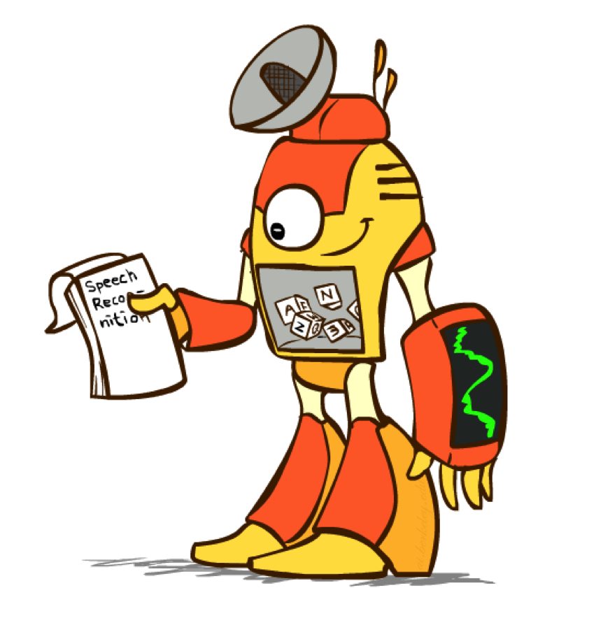
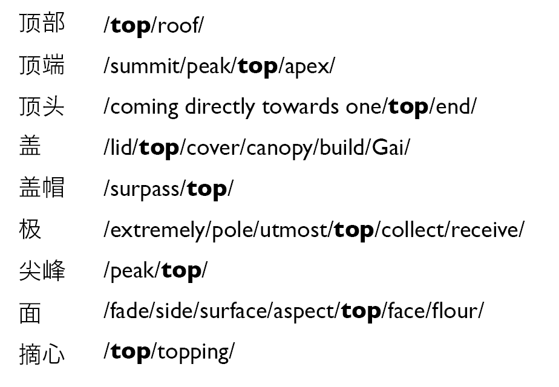
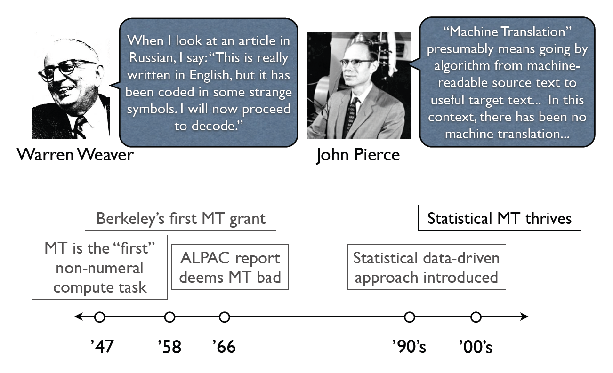
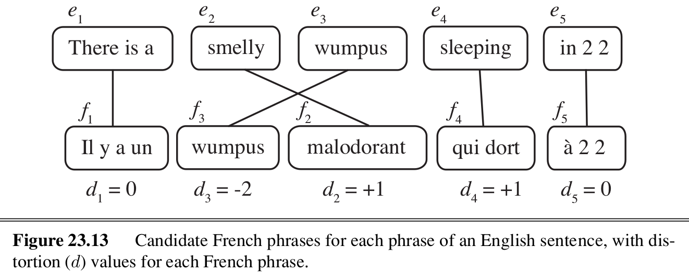
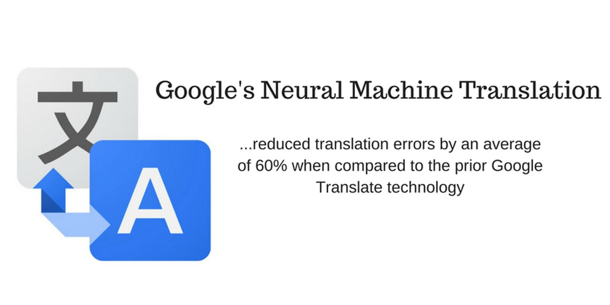
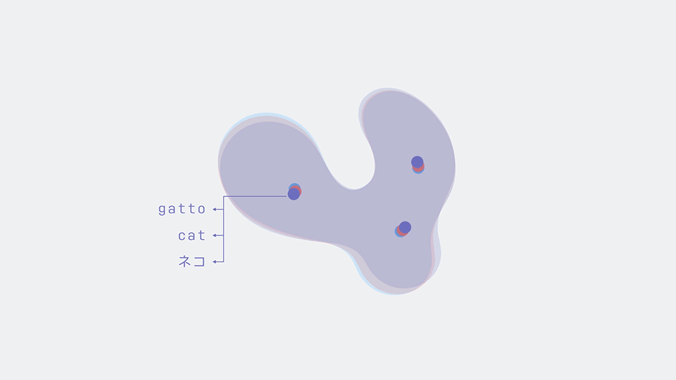
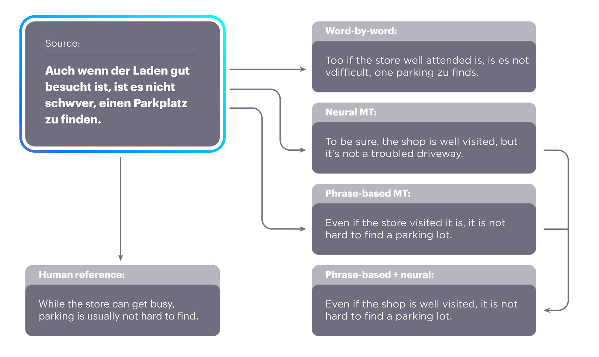
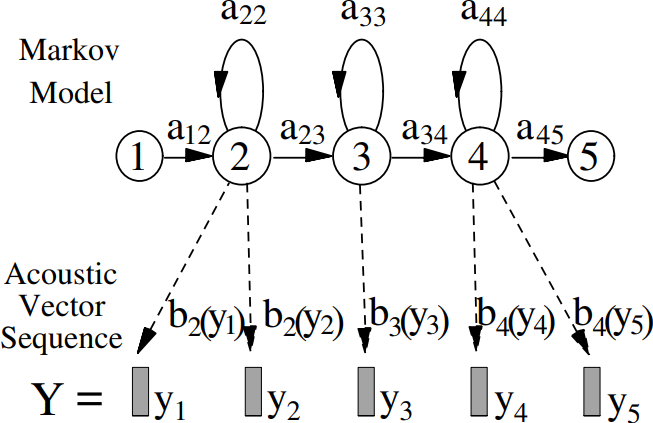

class: middle, center, title-slide

# Introduction to Artificial Intelligence

Lecture 10: Communication

  
Prof. Gilles Louppe 
[g.louppe@uliege.be](g.louppe@uliege.be)

???

R: check https://gitlab.com/Valiox/voice-transfer-across-languages
https://drive.google.com/file/d/1Q8SIQi57r6N5wvc4IPTxv0_tQ-D0K3Fb/view

http://lxmls.it.pt/2017/talk.pdf

---

# Today

.grid[
.kol-2-3[
Can you **talk** to an artificial agent? Can it understand what you say?

- Machine translation
- Speech recognition
- Speech synthesis
]
.kol-1-3[
.center.width-100[]
]
]

.footnote[Image credits: [CS188](http://ai.berkeley.edu/lecture_slides.html), UC Berkeley.]

---

class: middle

# Machine translation

---

class: middle

.center.width-100[]

## Machine translation

Automatic translation of text from one natural language (the source) to another (the target), while preserving the intended meaning.

[Q] How would engineer a machine translation system?

---

class: middle

## Issue of dictionary lookups

.center.width-90[]

.footnote[Image credits: [CS188](http://ai.berkeley.edu/lecture_slides.html), UC Berkeley.]

---

class: middle

.center.width-100[]

.center[To obtain a correct translation, one must decide whether "it" refers to the soccer ball or to the window. Therefore, one must understand physics as well as language.]

---

# History

.center.width-100[]

.footnote[Image credits: [CS188](http://ai.berkeley.edu/lecture_slides.html), UC Berkeley.]

---

# Data-driven machine translation

 
.center.width-100[]

.footnote[Image credits: [CS188](http://ai.berkeley.edu/lecture_slides.html), UC Berkeley.]

---

class: middle

## Machine translation systems

Translation systems must model the source and target languages, but systems vary in the type of models they use.
- Some systems analyze the source language text all the way into an interlingua knowledge representation and then generate sentences in the target language from that representation.
- Other systems are based on a *transfer model*. They keep a database of translation rules and whenever the rule matches, they translate directly. Transfer can occur at the lexical, syntactic or semantic level.

---

class: middle

.center.width-100[]

---

# Statistical machine translation

To translate an English sentence $e$ into a French sentence $f$, we seek the strings of words $f^\*$ such that
$$f^\* = \arg\max\_f P(f|e).$$

- The language model $P(f|e)$ is learned from a **bilingual corpus**, i.e. a collection of parallel texts, each an English/French pair.
- Most of the English sentences to be translated will be novel, but will be composed of phrases that that have been see before.
- The corresponding French phrases will be reassembled to form a French sentence that make sense.

---

class: middle

Given an English source sentence $e$, finding a French translation $f$ is a matter of three steps:
- Break $e$ into phrases $e\_1, ..., e\_n$.
- For each phrase $e\_i$, choose a corresponding French phrase $f\_i$. We use the notation $P(f\_i|e\_i)$ for the phrasal probability that $f\_i$ is a translation of $e\_i$.
- Choose a permutation of the phrases $f\_1, ..., f\_n$. For each $f\_i$, we choose a *distortion* $d\_i$, which is the number of words that phrase $f\_i$ has moved with respect to $f\_{i-1}$; positive for moving to the right, negative for moving the left.

---

class: middle

.center.width-100[]

---

class: middle

We define the probability $P(f,d|e)$ that the sequence of phrases $f$ with distortions $d$ is a translation of the sequence of phrases $e$.

Assuming mutual independence of each phrase translation and each distortion, we have
$$P(f,d|e) = \prod\_i P(f\_i | e\_i) P(d\_i).$$

- The best $f$ and $e$ cannot be found through enumeration because of the combinatorial explosion.
- Instead, local beam search with a heuristic that estimates probability has proven effective at finding a nearly-most-probable translation.

---

class: middle

All that remains is to learn the phrasal and distortion probabilities:
1. Find parallel texts.
2. Segment into sentences.
3. Align sentences.
4. Align phrases.
5. Extract distortions.
6. Improve estimates with expectation-minimization.

---

# Neural machine translation

Modern machine translation systems are all based on neural networks of various types.

 

.center.width-80[]

---

class: middle

## Attention-based recurrent neural network

.grid[
.kol-1-2[
- Encoder: bidirectional RNN, producing a set of annotation vectors $h\_i$.
- Decoder: attention-based.
    - Compute attention weights $\alpha\_{ij}$.
    - Compute the weighted sum of the annotation vectors, as a way to align the input words to the output words.
    - Decode using the context vector, the embedding of the previous output word and the hidden state.
]
.kol-1-2[
.center.width-100[]
]
]

---

class: middle

## Unsupervised machine translation

- The latest approaches do not even need to have a bilingual corpus!
- Machine translation can be learned in a **fully unsupervised** way with unsupervised alignment.

---

class: middle

Word-by-word translation:
- Learn a neural word embedding trained to predict the words around a given word using a context.
- Embedding in different languages share similar neighborhood structure.
- The system learn rotation of the word embedding in one language to match the word embedding in the other language, using adversarial training.
- This can be used to infer a fairly accurate bilingual dictionary without access to any translation!

.center.width-60[]

.footnote[Image credits: [Facebook AI Research](https://code.fb.com/ai-research/unsupervised-machine-translation-a-novel-approach-to-provide-fast-accurate-translations-for-more-languages/), Unsupervised machine translation.]

---

class: middle

Translating sentences:
- Bootstrap the translation model with word-by-word initialization.
- The neural translation model must be able to reconstruct a sentence in a given language from a noisy version of it.
- The model also learns to reconstruct any source sentence given a noisy translation of the same sentence in the target domain, and vice-versa.
- The source and target sentence latent representations are constrained to have the same latent distributions through adversarial training.

.center.width-70[]

.footnote[Image credits: [Lample et al, arXiv:1711.00043](https://arxiv.org/pdf/1711.00043.pdf).]

---

class: middle

.center.width-100[]

.footnote[Image credits: [Facebook AI Research](https://code.fb.com/ai-research/unsupervised-machine-translation-a-novel-approach-to-provide-fast-accurate-translations-for-more-languages/), Unsupervised machine translation.]

---

class: middle

# Speech recognition

???

R: check 23.5
R: check lec 15 of bair

---

class: middle, center, black-slide

.center.width-100[]

---

# HMM-based recognizer

   
.center.width-90[]

---

class: middle

The input audio waveform from a microphone is converted into a sequence of fixed size acoustic vectors $\mathbf{Y}\_{1:T} = \mathbf{y}\_1, ..., \mathbf{y}\_T$ in a process called feature extraction.

The decoder attempts to find the sequence of words $\mathbf{w}\_{1:L} = w\_1, ..., w\_L$ which is the most likely to have generated $\mathbf{Y}$:
$$\hat{\mathbf{w}} = \arg \max\_\mathbf{w} P(\mathbf{w}|\mathbf{Y})$$

Since $P(\mathbf{w}|\mathbf{Y})$ is difficult to model directly, Bayes' rule is the used to solve the equivalent problem
$$\hat{\mathbf{w}} = \arg \max\_\mathbf{w} p(\mathbf{Y}|\mathbf{w}) P(\mathbf{w}),$$
where
- the likelihood $p(\mathbf{Y}|\mathbf{w})$ is the acoustic model;
- the prior $P(\mathbf{w})$ is the language model.

---

class: middle

## Feature extraction

- The feature extraction seeks to provide a compact representation $\mathbf{Y}$ of the speech waveform.
- This form should minimize the loss of information that discriminates between words.
- One of the most widely used encoding schemes is based on *mel-frequency cepstral coefficients* (MFCCs).

---

class: middle

.center.width-100[

MFCCs calculation.]

.footnote[Image credits: [Giampiero Salvi, DT2118](https://www.kth.se/social/files/56fd38eaf276547ad14588ec/lecture.pdf), Lecture 2.]

---

class: middle

.center.width-90[]

$$\downarrow$$

.center.width-90[]

.center[Feature extraction from the signal in the time domain to MFCCs.]

.footnote[Image credits: [Haytham Fayek](https://haythamfayek.com/2016/04/21/speech-processing-for-machine-learning.html).]

---

class: middle

## HMM acoustic model

- A spoken word $w$ is decomposed into a sequence of $K\_w$ basic sounds called *base phones*.
  This sequence is called its pronunciation $\mathbf{q}^{(w)}\_{1:K\_w} = q\_1, ..., q\_{K\_w}$.
- The acoustic model allows for multiple pronunciations through marginalization:
$$p(\mathbf{Y}|\mathbf{w}) = \sum\_{\mathbf{Q}} p(\mathbf{Y}|\mathbf{Q}) P(\mathbf{Q}|\mathbf{w}),$$
where the summation is over all valid pronunciations sequences for $\mathbf{w}$, $\mathbf{Q}$ is a particular sequence of pronunciations,
$$P(\mathbf{Q}|\mathbf{w}) = \prod\_{l=1}^L P(\mathbf{q}^{(w\_l)}|w\_l)$$
and where each $\mathbf{q}^{(w\_l)}$ is a valid pronunciation for word $w\_l$.

---

class: middle

.center.width-60[]

Each base phone $q$ is represented by a continuous density HMM, where
- the transition probability parameter $a\_{ij}$ corresponds to the probability of making the particular transition from state $s\_i$ to $s\_j$;
- the output observation distributions are $b\_j(\mathbf{y}) = \mathcal{N}(\mathbf{y}; \mu^{(j)}, \Sigma^{(j)})$.

---

class: middle

Given the composite HMM $\mathbf{Q}$ formed by concatenating all the constituent base phones $\mathbf{q}^{w\_1}, ..., \mathbf{q}^{w\_L}$, the acoustic likelihood is given by
$$
p(\mathbf{Y}|\mathbf{Q}) = \sum\_\mathbf{s} p(\mathbf{s},\mathbf{Y}|\mathbf{Q})
$$
where $\mathbf{s} = s\_0, ..., s\_{T+1}$ is a state sequence through the composite model
and
$$p(\mathbf{s},\mathbf{Y}|\mathbf{Q}) = a\_{s\_0, s\_1} \prod\_{t=1}^T b\_{s\_t}(\mathbf{y}\_t) a\_{s\_t s\_{t+1}}.$$

From this formulation, all model parameters can be efficiently estimated from a corpus of training utterances with expectation-minimization.

---

class: middle

## N-gram language model

The prior probability of a word sequence $\mathbf{w} = w\_1, ..., w\_L$ is given by
$$P(\mathbf{w}) = \prod\_{l=1}^L P(w\_k | w\_{k-1}, ..., w\_{k-N+1}).$$

The N-gram probabilities probabilities are estimated from training texts by counting N-gram occurrences to form maximum likelihood estimates.

---

class: middle

## Decoding

Inference is carried out by running a variant of Viterbi.

---

# Neural speech recognition

---

class: middle

# Speech synthesis

---

wavenet

---

video of the google assistant booking a restaurant

---

# Summary

---

class: end-slide, center
count: false

The end.

---

# References
