class: middle, center, title-slide

# Introduction to Artificial Intelligence

Lecture 2: Solving problems by searching

  
Prof. Gilles Louppe 
[g.louppe@uliege.be](mailto:g.louppe@uliege.be)

???

Check slide 22 of https://www.ics.uci.edu/~kkask/Fall-2016%20CS271/slides/03-InformedHeuristicSearch.pdf
=> without reopening requires consistency
=> if re-opening, admissibility is enough

R: prepare solutions for bfs, dfs and astar

R: pacman demo
insist on the fact that the goal is to have eaten all, not one

---

# Today

.grid[
.kol-1-2[
- Planning agents
- Search problems
- Uninformed search methods
    - Depth-first search
    - Breadth-first search
    - Uniform-cost search
- Informed search methods
    - A*
    - Heuristics
]
.kol-1-2[
.center.width-100[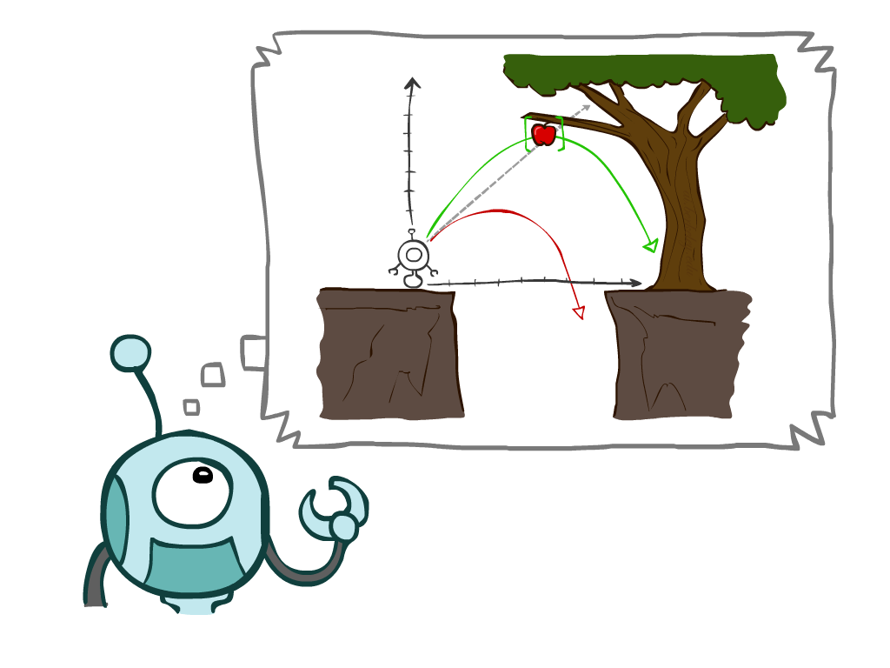]

]
]

.footnote[Image credits: [CS188](http://ai.berkeley.edu/lecture_slides.html), UC Berkeley.]

---

class: middle

# Planning agents

---

# Reflex agents

Reflex agents
- select actions on the basis of the current percept;
- may have a model of the world current state;
- do not consider the future consequences of their actions;
- consider only **how the world is now**.

.grid[
.kol-1-2[
.width-100[]]
.kol-1-2[
.width-100[]]
]
.caption[For example, a simple reflex agent based on condition-action rules could move 
         to a dot if there is one in its neighborhood.
         No planning is involved to take this decision. ]

.Q[[Q]] Can a reflex agent be rational?

???

Yes, provided the correct decision can be made on the basis of the current percept. That is, if the environment is fully observable, deterministic and known.

In the figure, the sequence of actions is clearly suboptimal.

---

# Problem-solving agents

Assumptions:
- *Observable*, *deterministic* (and *known*) environment.

Problem-solving agents
- take decisions based on (hypothesized) consequences of actions;
- must have a model of how the world evolves in response to actions;
- formulate a goal, explicitly;
- consider **how to world would be**.

.grid[
.kol-1-2[
.width-100[]
]
.kol-1-2[
.width-100[]
]
]
.caption[A planning agent looks for sequences of actions to eat all the dots.]

---

class: middle

.width-100[]

---

class: middle

## Offline vs. Online solving

- Problem-solving agents are **offline**. The solution is executed "eyes closed", ignoring the percepts.
- *Online* problem solving involves acting without complete knowledge. In this case, the sequence of actions might be recomputed at each step.

---

class: middle

# Search problems

---

# Search problems

A **search problem** consists of the following components:
- The *initial state* of the agent.
- A description of the *actions* available to the agent given a state $s$, denoted $\text{actions}(s)$.
- A *transition model* that returns the state $s' = \text{result}(s, a)$ that results from doing action $a$ in state $s$.
    - We say that $s'$ is a *successor* of $s$ if there is an acceptable action from $s$ to $s'$.

.center[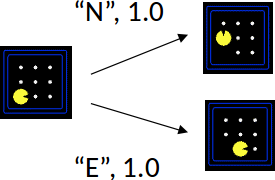]

---

class: middle

.center[]

- Together, the initial state, the actions and the transition model define the **state space** of the problem, i.e. the set of all states reachable from the initial state by any sequence of action.
    - The state space forms a directed graph:
        - nodes = states
        - links = actions
    - A path is a sequence of states connected by actions.
- A *goal test* which determines whether the solution of the problem is achieved in state $s$.
- A *path cost* that assigns a numeric value to each path.
  - In this course, we will also assume that the path cost corresponds to a sum of strictly positive *step costs* $c(s,a,s')$  associated to the action $a$ in $s$ leading to $s'$.

---

class: middle

A *solution* to a problem is an action sequence that leads from the initial state to a goal state.
- A solution quality is measured by the path cost function.
- An **optimal solution** has the lowest path cost among all solutions.

[Q] What if the environment is partially observable? non-deterministic?

???

With partial observability, the agent needs to keep in which states it might be in.
- Percepts narrow down the set of possible states.

If stochastic, the agent will need to consider what to do for each contingency that its percepts may reveal.
- Percepts reveal which the outcomes has actually occurred.

See 4.3 and 4.4 for more details.

---

class: middle

## Example: Traveling in Romania

.center.width-100[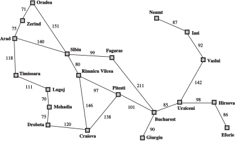]

.caption[How to go from Arad to Bucharest?]

---

class: middle

- Initial state = the city we start in.
    - $s_0 = \text{in}(\text{Arad})$
- Actions = Going from the current city to the cities that are directly connected to it.
    - $\text{actions}(s_0) = \\{ \text{go}(\text{Sibiu}), \text{go}(\text{Timisoara}), \text{go}(\text{Zerind}) \\}$
- Transition model = The city we arrive in after driving to it.
    - $\text{result}(\text{in}(Arad), \text{go}(Zerind)) = \text{in}(Zerind)$
- Goal test: whether we are in Bucharest.
    - $s \in \\{ \text{in}(\text{Bucharest}) \\}$
- Step cost: distances between cities.

---

# Selecting a state space

The real world is absurdly **complex**.
- The *world state* includes every last detail of the environment.
- A *search state* keeps only the details needed for planning.

.width-75.center[]
.center[Search problems are **models**.]

.footnote[Image credits: [CS188](http://ai.berkeley.edu/lecture_slides.html), UC Berkeley.]

???

Search problems are models, i.e. abstract mathematical abstractions. These models omit details that not relevant for solving the problem.

The process of removing details from a representation is called abstraction.

---

class: middle

##  Example: eat-all-dots
- States: $\\{ (x, y), \text{dot booleans}\\}$
- Actions: NSEW
- Transition: update location and possibly a dot boolean
- Goal test: dots all false

.width-100.center[]

---

class: middle

## State space size

.grid[
.kol-1-2[
- *World state*:
    - Agent positions: 120
    - Found count: 30
    - Ghost positions: 12
    - Agent facing: NSEW
- *How many?*
    - World states?
        - $120 \times 2^{30} \times 12^2 \times 4$
    - States for eat-all-dots?
        - $120 \times 2^{30}$
]
.kol-1-2[
.width-100[]
]
]

---

# Search trees

The set of acceptable sequences starting at the initial state form a **search tree**.
- Nodes correspond to states in the state space, where the initial state is the root node.
- Branches correspond to applicable actions, with child nodes corresponding to successors.

For most problems, we can never actually build the whole tree.

.center[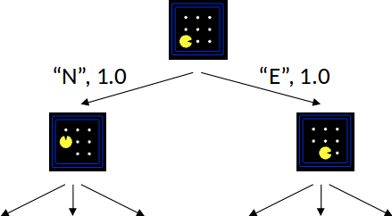]

---

# Tree search algorithms

.width-100[]

## Important ideas
- Fringe (or frontier) of partial plans under consideration
- Expansion
- Exploration

[Q] Which fringe nodes to explore? How to expand as few nodes as possible, while achieving the goal?

---

class: middle

.center.width-90[]

---

# Uninformed search strategies

**Uninformed** search strategies use only the information available in the problem definition.
They do not know whether a state looks more promising than some other.

## Strategies
- Depth-first search
- Breadth-first search
- Uniform-cost search
- Iterative deepening

---

# Properties of search strategies

- A strategy is defined by picking the **order of expansion**.
- Strategies are evaluated along the following dimensions:
    - *Completeness*: does it always find a solution if one exists?
    - *Optimality*: does it always find the least-cost solution?
    - *Time complexity*: how long does it take to find a solution?
    - *Space complexity*: how much memory is needed to perform the search?
- Time and complexity are measured in terms of
    - $b$: maximum branching factor of the search tree
    - $d$: depth of the least-cost solution
        * the depth of $s$ is defined as the number of actions from the initial state to $s$.
    - $m$: maximum length of any path in the state space (may be $\infty$)

---

# Depth-first search

  
.width-100[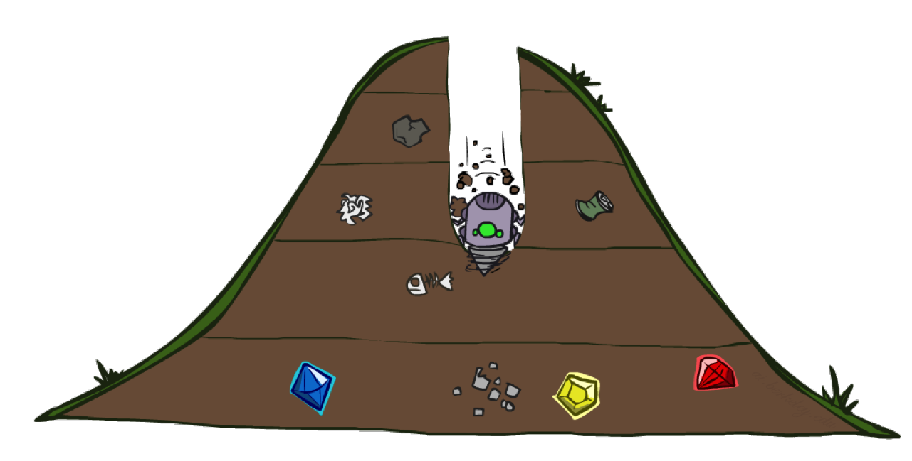]

.footnote[Image credits: [CS188](http://ai.berkeley.edu/lecture_slides.html), UC Berkeley.]

---

class: middle

- *Strategy*: expand the deepest node in the fringe.
- *Implementation*: fringe is a **LIFO stack**.

.width-80.center[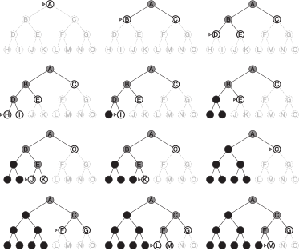]

---

class: middle

.center.width-80[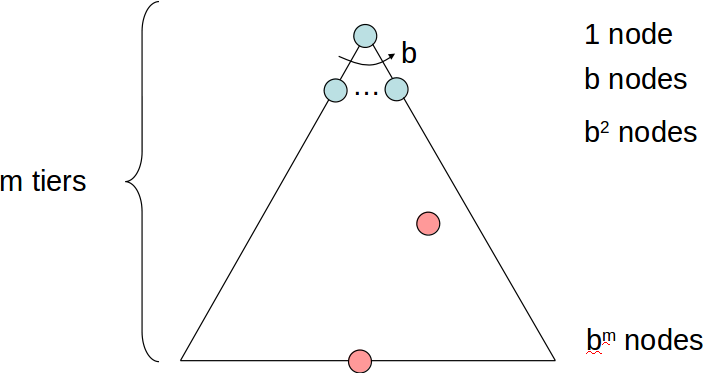]

???

[Q] Number of nodes in a tree?
Number of nodes = $\frac{b^{d+1}-1}{b-1}$

---

class: middle

.center.width-80[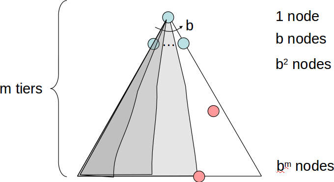]

---

class: middle

## Properties of DFS

- *Completeness*:
    - $m$ could be infinite, so only if we prevent cycles (more on this later).
- *Optimality*:
    - No, DFS finds the leftmost solution, regardless of depth or cost.
- *Time complexity*:
    - May generate the whole tree (or a good part of it, regardless of $d$).
      Therefore $O(b^m)$, which might much greater than the size of the state space!
- *Space complexity*:
    - Only store siblings on path to root, therefore $O(bm)$.
    - When all the descendants of a node have been visited, the node can be removed from memory.

---

# Breadth-first search

  
.width-100[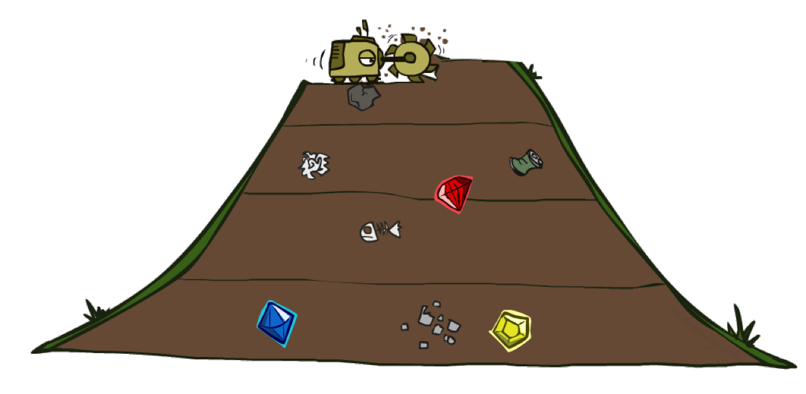]

.footnote[Image credits: [CS188](http://ai.berkeley.edu/lecture_slides.html), UC Berkeley.]

---

class: middle

- *Strategy*: expand the shallowest node in the fringe.
- *Implementation*: fringe is a **FIFO queue**.

.width-80.center[]

---

class: middle

.center.width-80[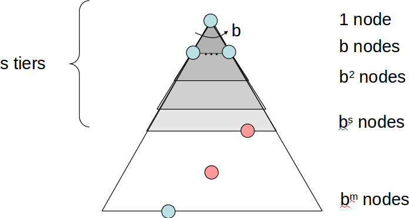]

---

class: middle

## Properties of BFS

- *Completeness*:
    - If the shallowest goal node is at some finite depth $d$, BFS will eventually find it after generating all shallower nodes (provided $b$ is finite).
- *Optimality*:
    - The shallowest goal is not necessarily the optimal one.
    - BFS is optimal only if the path cost is a non-decreasing function of the depth of the node.
- *Time complexity*:
    - If the solution is a depth $d$, then the total number of nodes generated before finding this node is $b+b^2+b^3+...+b^d = O(b^d)$
- *Space complexity*:
    - The number of nodes to maintain in memory is the size of the fringe, which will be the largest at the last tier. That is $O(b^d)$

---

# Iterative deepening

Idea: get DFS's space advantages with BFS's time/shallow solution advantages.
- Run DFS with depth limit 1.
- If no solution, run DFS with depth limit 2.
- If no solution, run DFS with depth limit 3.
    - ...

.grid[
.kol-1-2[
[Q] What are the properties of iterative deepening?

[Q] Isn't this process wastefully redundant?
]
.kol-1-2[
.center.width-80[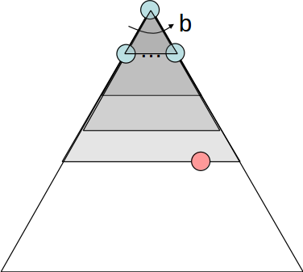]
]
]

---

# Uniform-cost search

  
.width-100[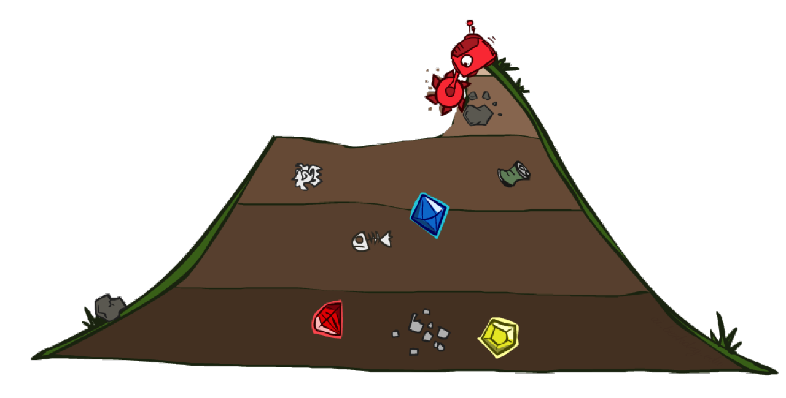]

.footnote[Image credits: [CS188](http://ai.berkeley.edu/lecture_slides.html), UC Berkeley.]

---

class: middle

- *Strategy*: expand the cheapest node in the fringe.
- *Implementation*: fringe is a **priority queue**, using the cumulative cost $g(n)$ from the initial state to node $n$ as priority.

---

class: middle

.center.width-70[]

---

class: middle

## Properties of UCS

- *Completeness*:
    - Yes, if step cost are all such that $c(s,a,s') \geq \epsilon > 0$. (Why?)
- *Optimality*:
    - Yes, sinces UCS expands nodes in order of their optimal path cost.
- *Time complexity*:
     - Assume $C^\*$ is the cost of the optimal solution and that step costs are all $\geq \epsilon$.
     - The "effective depth" is then roughly $C^\*/\epsilon$.
     - The worst-case time complexity is $O(b^{C^\*/\epsilon})$.
- *Space complexity*:
     - The number of nodes to maintain is the size of the fringe, so as many as in the last tier $O(b^{C^\*/\epsilon})$.

---

# Informed search strategies

.center.width-70[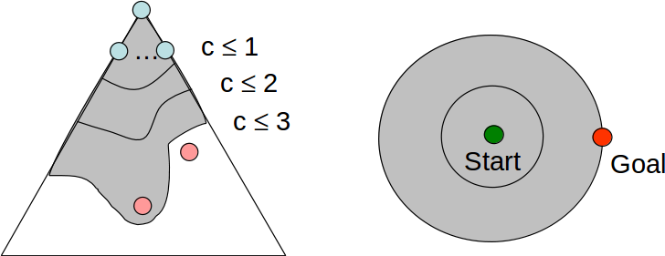]

One of the **issues of UCS** is that it explores the state space in *every direction*,
without exploiting information about the (plausible) location of the goal node.

**Informed** search strategies aim to solve this problem by expanding nodes in
the fringe in decreasing order of *desirability*.
- Greedy search
- A*

---

# Greedy search

 
.width-100[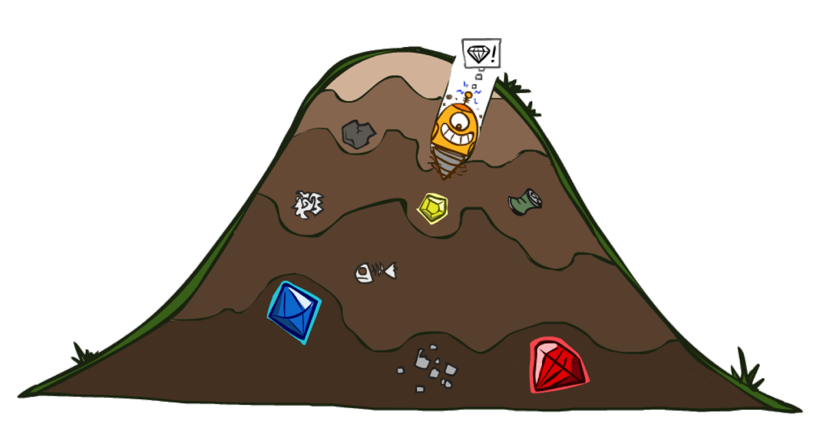]

.footnote[Image credits: [CS188](http://ai.berkeley.edu/lecture_slides.html), UC Berkeley.]

---

class: middle

## Heuristics

A **heuristic** (or evaluation) function $h(n)$ is:
- a function that *estimates* the cost of the cheapest path from node $n$ to a goal state;
    - $h(n) \geq 0$ for all nodes $n$
    - $h(n) = 0$ for a goal state.
- is designed for a *particular* search problem.

 
.center.width-70[]

---

class: middle

## Greedy search

- *Strategy*: expand the node $n$ in the fringe for which $h(n)$ is the lowest.
- *Implementation*: fringe is a **priority queue**, using $h(n)$ as priority.

---

class: middle, center

.width-80[]

$h(n)$ = straight line distance to Bucharest.

---

class: middle

.center.width-90[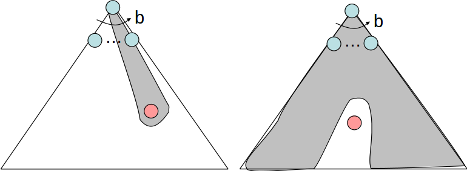]

.center[At best, greedy search takes you straight to the goal. 
At worst, it is like a badly-guided BFS.]

---

class: middle

## Properties of greedy search

- *Completeness*:
    - No, unless we prevent cycles (more on this later).
- *Optimality*:
    - No, e.g. the path via Sibiu and Fagaras is 32km longer than the path through Rimnicu Vilcea and Pitesti.
- *Time complexity*:
    - $O(b^m)$, unless we have a good heuristic function.
- *Space complexity*:
    - $O(b^m)$, unless we have a good heuristic function.

---

# A*

  
.width-100[]

.footnote[Image credits: [CS188](http://ai.berkeley.edu/lecture_slides.html), UC Berkeley.]

---

class: middle

.grid[
.kol-1-2[    
## Shakey the Robot

- A\* was first proposed in **1968** to improve robot planning.
- Goal was to navigate through a room with obstacles.
]
.kol-1-2[
.center.width-80[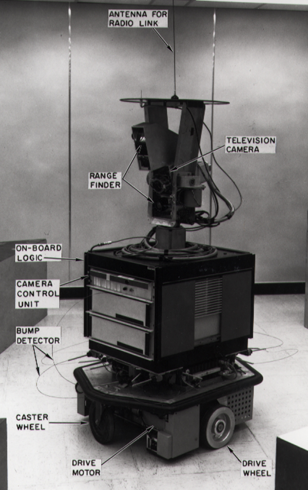]
]
]

---

class: middle

## A*

- Uniform-cost orders by path cost, or *backward cost* $g(n)$
- Greedy orders by goal proximity, or *forward cost* $h(n)$
- **A*** combines the two algorithms and orders by the sum $$f(n) = g(n) + h(n)$$
- $f(n)$ is the estimated cost of cheapest solution through $n$.

---

class: middle

.center.width-80[]

---

class: middle

.center.width-80[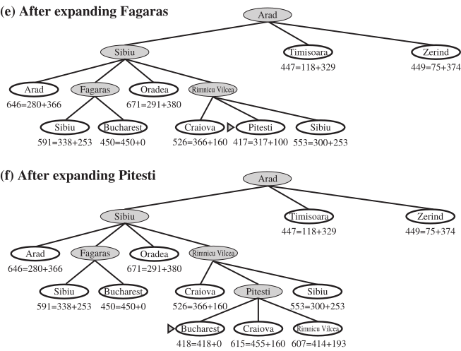]

[Q] Why doesn't A* stop at step (e), since Bucharest is in the fringe?

---

class: middle

## Admissible heuristics

A heuristic $h$ is **admissible** if $$0 \leq h(n) \leq h^\*(n)$$ where $h^\*(n)$ is the true cost to a nearest goal.

.center.width-80[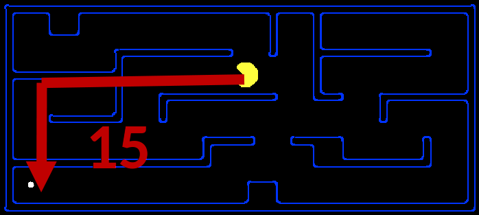]
.caption[The Manhattan distance is admissible]

???

$h$ is admissible if it underestimates the true cost towards the goal.

---

class: middle

## Optimality of A*

.grid[
.kol-2-3[
Assumptions:
- $A$ is an optimal goal node
- $B$ is a suboptimal goal node
- $h$ is admissible

Claim:
$A$ will exit the fringe before $B$.
]
.kol-1-3[
.width-100[]
]
]

---

class: middle

.grid[
.kol-2-3[
## Proof

Assume $B$ is on the fringe.
Some ancestor $n$ of $A$ is on the fringe too.

- $f(n) \leq f(A)$
    - $f(n) = g(n) + h(n)$ (by definition)
    - $f(n) \leq g(A)$ (admissibility of $h$)
    - $f(A) = g(A) + h(A) = g(A)$ ($h=0$ at a goal)
- $f(A) < f(B)$
    - $g(A) < g(B)$ ($B$ is suboptimal)
    - $f(A) < f(B)$ ($h=0$ at a goal)
- Therefore, $n$ expands before $B$.
    - since $f(n) \leq f(A) < f(B)$
]
.kol-1-3[
.width-100[]
]
]
Similarly, all ancestors of $A$ expand before $B$, including $A$. Therefore **A* is optimal**.

---

class: middle

## A* contours

- Assume $f$-costs are non-decreasing along any path.
- We can define **contour levels** $t$ in the state space, that include all nodes $n$ for which $f(n) \leq t$.

.center[

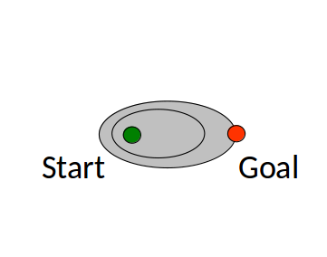]
.grid[
.kol-1-2[For UCS ($h(n)=0$ for all $n$), bands are circular around the start.]
.kol-1-2[For A* with accurate heuristics, bands stretch towards the goal.]
]

---

class: middle

.grid[
.kol-1-3[
.width-100[]
]
.kol-1-3[
.width-100[]
]
.kol-1-3[
.width-100[]
]
]
.center.grid[
.kol-1-3[
Greedy search
]
.kol-1-3[
UCS
]
.kol-1-3[
A*
]
]

.footnote[Image credits: [CS188](http://ai.berkeley.edu/lecture_slides.html), UC Berkeley.]

???

A\* finds the shortest path.

---

# Creating admissible heuristics

Most of the work in solving hard search problems optimally is in finding admissible heuristics.

Admissible heuristics can be derived from the exact solutions to *relaxed problems*, where new actions are available.

  
.center.width-80[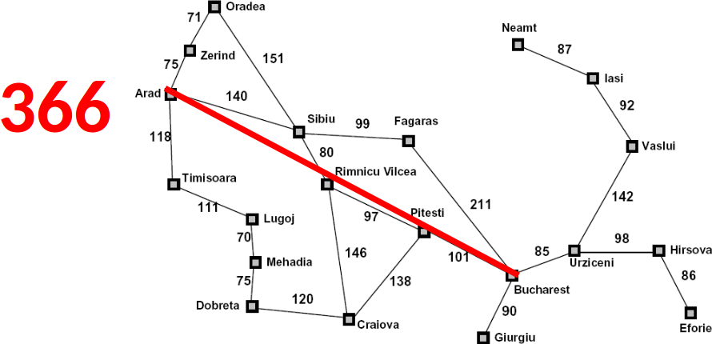]

---

class: middle

## Dominance

- If $h_1$ and $h_2$ are both admissible and if $h_2(n) \geq h_1(n)$ for all $n$, then $h_2$ **dominates** $h_1$ and is *better* for search.
- Given any admissible heuristics $h_a$ and $h_b$, $$h(n) = \max(h_a(n), h_b(n))$$ is also admissible and dominates $h_a$ and $h_b$.

---

class: middle

## Learning heuristics from experience

- Assuming an *episodic* environment, an agent can **learn** good heuristics by playing the game many times.
- Each optimal solution $s^\*$ provides *training examples* from which $h(n)$ can be learned.
- Each example consists of a state $n$ from the solution path and the actual cost $g(s^\*)$ of the solution from that point.
- The mapping $n \to g(s^\*)$ can be learned with **supervised learning** algorithms.
    - Linear models, Neural networks, etc.

---

# Graph search

.center.width-80[]

The failure to detect **repeated states** can turn a linear problem into an exponential one. It can also lead to non-terminating searches.

Redundant paths and cycles can be avoided by **keeping track** of the states that have been *explored*.
This amounts to grow a tree directly on the state-space graph.

---

class: middle

.width-100[]

---

class: middle

## A* graph-search gone wrong?

---

class: middle

## Consistency of heuristics

---

class: middle

## Optimality of A* (graph-search)

---

# Recap example: Super Mario

.center.width-50[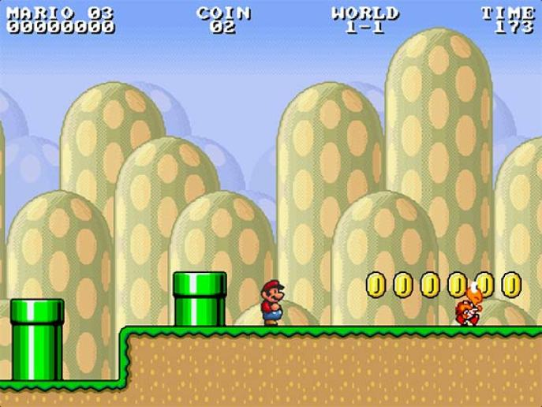]

- *Task environment*?
    - performance measure, environment, actuators, sensors?
- *Type* of environment?
- *Search problem*?
    - initial state, actions, transition model, goal test, path cost?
- *Good heuristic*?

???

- performance measure = score, the further right, the better; coins; killed enemies, ...
- environment: the Mario world
- actuators: left, right, up, down, jump, speed
- sensors: the screen

- type of environment: partially observable, deterministic, episodic, dynamic, discrete/continuous, multi-agent, known

- search problem:
    * state = Mario's position (x, y), map, score, time
    * initial state = start of the game
    * transition model = given by the game engine (assume we know that!)
    * goal test = have we reached the flag?
    * path cost = shortest path, the better; malus if killed, bonus if coin and killed enemies

---

class: center, middle, black-slide

<iframe width="600" height="400" src="https://www.youtube.com/embed/DlkMs4ZHHr8" frameborder="0" allowfullscreen></iframe>

A* in action

???

Comment on the actions taken at any frame (right, jump, speed) shown in red.

---

# Summary

- Problem formulation usually requires **abstracting away real-world details** to define a state space that can feasibly be explored.
- Variety of uninformed search strategies (*DFS*, *BFS*, *UCS*, *Iterative deepening*)
- **Heuristic functions** estimate costs of shortest paths.
- Good heuristic can dramatically *reduce search cost*.
- **Greedy best-first search** expands lowest $h$.
    - incomplete and not always optimal.
- **A*** search expands lower $f=g+h$
    - complete* and optimal
- Admissible heuristics can be derived from exact solutions of relaxed problems or learned from training examples.
- *Graph search* can be exponentially more efficient than tree search.

---

class: end-slide, center
count: false

The end.

---

# References

- Hart, Peter E., Nils J. Nilsson, and Bertram Raphael. "A formal basis for the heuristic determination of minimum cost paths." IEEE transactions on Systems Science and Cybernetics 4.2 (1968): 100-107.
