class: middle, center, title-slide

# Introduction to Artificial Intelligence

Lecture 2: Solving problems by searching

---

# Today

- Agents that plan ahead
- Search problems
- Uninformed search methods
    - Depth-first search
    - Breadth-first search
    - Uniform-cost search
- Informed search methods
    - A*
    - Heuristics

---

# Reflex agents

Reflex agents:
- Select actions on the basis of the current percept.
- May have a model of the world current state.
- Do not consider the future consequences of their actions.
- Consider only **how the world is now**.

[Q] Can a reflex agent be rational?

.grid[
.col-1-2[

]
.col-1-2[

]
]

---

# Problem-solving agents

Assumptions:
- *Observable*, *deterministic* (and *known*) environment.

Problem-solving agents:
- Take decisions based on (hypothesized) consequences of actions.
- Must have a model of how the world evolves in response to actions.
- Formulate a goal.
- Consider **how to world would be**.

.grid[
.col-1-2[
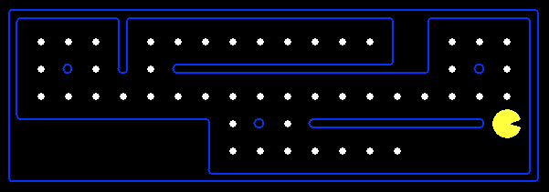
]
.col-1-2[
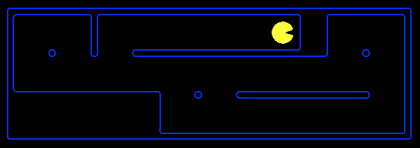
]
]

---

.stretch[]

Notes:
- This is *offline* problem solving. The solution is executed "eyes closed", ignoring the percepts.
- *Online* problem solving involves acting without complete knowledge.

---

# Search problems

A **search problem** consists of the following components:
- The *initial state* of the agent.
- A description of the *actions* available to the agent given a state $s$, denoted $\text{actions}(s)$.
- A *transition model* that returns the state $s' = \text{result}(s, a)$ that results from doing action $a$ in state $s$.
    - We say that $s'$ is a *successor* of $s$ if there is an acceptable action from $s$ to $s'$.

.center[]

---

- Together, the initial state, the actions and the transition model define the *state space* of the problem, i.e. the set of all states reachable from the initial state by any sequence of action.
    - The state space forms a directed graph in which the nodes are states and links between nodes are actions.
    - A path is a sequence of states connected by actions.

.center[]

- A *goal test* which determines whether the solution of the problem is achieved in state $s$.
- A *path cost* that assigns a numeric value to each path.
  - We may also assume that the path cost corresponds to a sum of positive *step costs* $c(s,a,s')$  associated to the action $a$ in $s$ leading to $s'$.

---

A **solution** to a problem is an action sequence that leads from the initial state to a goal state.
- A solution quality is measured by the path cost function.
- An *optimal solution* has the lowest path cost
among all solutions.

[Q] What if the environment is partially observable? non-deterministic?

---

# Search problems are models

.stretch[]

.footnote[Credits: UC Berkeley, [CS188](http://ai.berkeley.edu/lecture_slides.html)]

---

# Example: Traveling in Romania

.center[]

- Initial state = the city we start in.
    - $s_0 = \text{in}(\text{Arad})$
- Actions = Going from the current city to the cities that are directly connected to it.
    - $\text{actions}(s_0) = \\{ \text{go}(\text{Sibiu}), \text{go}(\text{Timisoara}), \text{go}(\text{Zerind}) \\}$

---

- Transition model = The city we arrive in after driving to it.
    - $\text{result}(\text{in}(Arad), \text{go}(Zerind)) = \text{in}(Zerind)$
- Goal test: whether we are in Bucharest.
    - $s \in \\{ \text{in}(\text{Bucharest}) \\}$
- Step cost: distances between cities.

---

# Selecting a state space

- Real world is absurdly complex.
    - The *world state* includes every last detail of the environment.
    - State space must be abstracted for problem solving.
- A *search state* keeps only the details needed for planning.
    - Example: eat-all-dots
        - States: $\\{ (x, y), \text{dot booleans}\\}$
        - Actions: NSEW
        - Transition: update location and possibly a dot boolean
        - Goal test: dots all false

.stretch[]

---

# State space size

.grid[
.col-1-2[
- *World state*:
    - Agent positions: 120
    - Found count: 30
    - Ghost positions: 12
    - Agent facing: NSEW
- *How many?*
    - World states?
        - $120 \times 2^{30} \times 12^2 \times 4$
    - States for eat-all-dots?
        - $120 \times 2^{30}$
]
.col-1-2[

]
]

---

# Search trees

The set of possible acceptable sequences starting at the initial state form a **search tree**:
- Nodes correspond to states in the state space, where the initial state is the root node.
- Branches correspond to applicable actions.
    - Child nodes correspond to successors.
- **For most problems, we can never actually build the whole tree**.

.center[]

---

# Tree search algorithms

.stretch[]

Important ideas:
- *Fringe* (or *frontier*) of partial plans under consideration
- *Expansion*
- *Exploration*

[Q] Which fringe nodes to explore? How to expand as few nodes as possible, while achieving the goal?

---

# Tree search example

.center[]

---

# Uninformed search strategies

**Uninformed** search strategies use only the information available in the problem definition.

- Depth-first search
- Breadth-first search
- Uniform-cost search
- Iterative deepening

---

# Depth-first search

.stretch[]

.footnote[Credits: UC Berkeley, [CS188](http://ai.berkeley.edu/lecture_slides.html)]

---

# Depth-first search

- *Strategy*: expand the deepest node in the fringe.
- *Implementation*: fringe is a **LIFO stack**.

.center[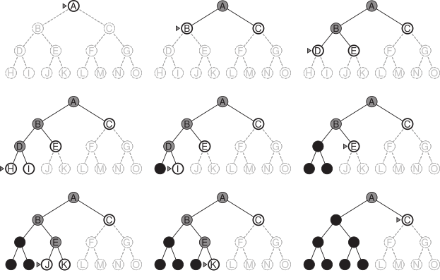]

---

class: smaller

# Properties of search strategies

- A strategy is defined by picking the **order of expansion**.
- Strategies are evaluated along the following dimensions:
    - *Completeness*: does it always find a solution if one exists?
    - *Optimality*: does it always find the least-cost solution?
    - *Time complexity*: how long does it take to find a solution?
    - *Space complexity*: how much memory is needed to perform the search?
- Time and complexity are measured in terms of
    - $b$: maximum branching factor of the search tree
    - $d$: depth of the least-cost solution
    - $m$: maximum length of any path in the state space (may be $\infty$)

[Q] Number of nodes in a tree?

.center.width-50[]

---

class: smaller

# Properties of DFS

- *Completeness*:
    - $m$ could be infinite, so only if we prevent cycles (more on this later).
- *Optimality*:
    - No, DFS finds the leftmost solution, regardless of depth or cost.
- *Time complexity*:
    - May generate the whole tree (or a good part of it, regardless of $d$).
      Therefore $O(b^m)$, which might much greater than the size of the state space!
- *Space complexity*:
    - Only store siblings on path to root, therefore $O(bm)$.

.center.width-50[]

---

# Breadth-first search

.stretch[]

.footnote[Credits: UC Berkeley, [CS188](http://ai.berkeley.edu/lecture_slides.html)]

---

# Breadth-first search

- *Strategy*: expand the shallowest node in the fringe.
- *Implementation*: fringe is a **FIFO queue**.

.center[]

---

class: smaller

# Properties of BFS

- *Completeness*:
    - If the shallowest goal node is at some finite depth $d$, BFS will eventually find it after generating all shallower nodes (provided $b$ is finite).
- *Optimality*:
    - The shallowest goal is not necessarily the optimal one.
    - BFS is optimal only if the path cost is a non-decreasing function of the depth of the node.
- *Time complexity*:
    - If the solution is a depth $d$, then the total number of nodes generated before finding this node is $b+b^2+b^3+...+b^d = O(b^d)$
- *Space complexity*:
    - The number of nodes to maintain in memory is the size of the fringe, which will be the largest at the last tier. That is $O(b^d)$

.center.width-50[]

---

# Iterative deepening

- Idea: get DFS's space advantages with BFS's time/shallow solution advantages.
    - Run DFS with depth limit 1.
    - If no solution, run DFS with depth limit 2.
    - If no solution, run DFS with depth limit 3.
    - ...

.grid[
.col-2-3[
[Q] What are the properties of iterative deepening?

[Q] Isn't this process wastefully redundant?
]
.col-1-4[

]
]

---

# Uniform-cost search

.stretch[]

.footnote[Credits: UC Berkeley, [CS188](http://ai.berkeley.edu/lecture_slides.html)]

---

# Uniform-cost search

- *Strategy*: expand the cheapest node in the fringe.
- *Implementation*: fringe is a **priority queue**, using the cumulative cost $g(n)$ from the initial state to node $n$ as priority.

---

class: smaller

# Properties of UCS

- *Completeness*:
    - Yes, if step cost $\geq \epsilon > 0$.
- *Optimality*:
    - Yes, sinces UCS expands nodes in order of their optimal path cost.
- *Time complexity*:
     - Assume $C^\*$ is the cost of the optimal solution and that step costs are all $\geq \epsilon$.
     - The "effective depth" is then roughly $C^\*/\epsilon$.
     - The worst-case time complexity is $O(b^{C^\*/\epsilon})$.
- *Space complexity*:
     - The number of nodes to maintain is the size of the fringe, so as many as in the last tier $O(b^{C^\*/\epsilon})$.

.center.width-40[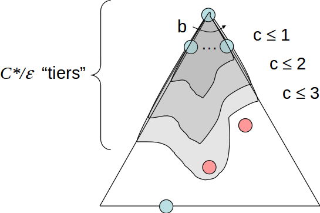]

---

# Informed search strategies

One of the **issues of UCS** is that it explores the state space in *every direction*,
without exploiting information about the (plausible) location of the goal node.

.center.width-50[]

**Informed** search strategies aim to solve this problem by expanding nodes in
the fringe in decreasing order of *desirability*.
- Greedy search
- A*

---

# Heuristics

A **heuristic** (or evaluation) function $h(n)$ is:
- a function that *estimates* the cost of the cheapest path from node $n$ to a goal state;
    - $h(n) \geq 0$ for all nodes $n$
    - $h(n) = 0$ for a goal state.
- is designed for a *particular* search problem.

.center.width-70[]

---

# Greedy search

.stretch[]

.footnote[Credits: UC Berkeley, [CS188](http://ai.berkeley.edu/lecture_slides.html)]

---

# Greedy search

- *Strategy*: expand the node $n$ in the fringe for which $h(n)$ is the lowest.
- *Implementation*: fringe is a **priority queue**, using $h(n)$ as priority.

---

# Greedy search example

$h(n)$ = straight line distance to Bucharest.

.center.width-70[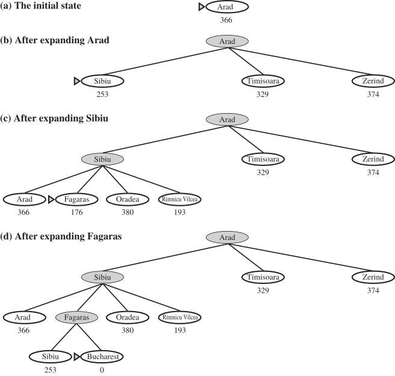]

---

class: smaller

# Properties of greedy search

- *Completeness*:
    - No, unless we prevent cycles (more on this later).
- *Optimality*:
    - No, e.g. the path via Sibiu and Fagaras is 32km longer than the path through Rimnicu Vilcea and Pitesti.
- *Time complexity*:
    - $O(b^m)$, unless we have a good heuristic function.
- *Space complexity*:
    - $O(b^m)$, unless we have a good heuristic function.

.center.width-70[]
.caption[At best, greedy search takes you straight to the goal. At worst, it is like a badly-guided BFS.]

---

# A*

.stretch[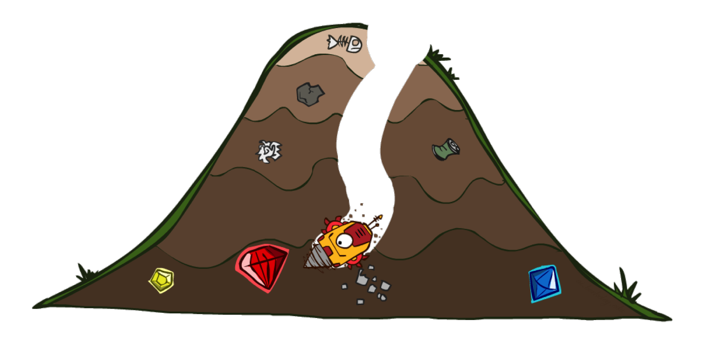]

.footnote[Credits: UC Berkeley, [CS188](http://ai.berkeley.edu/lecture_slides.html)]

---

# A*

- Uniform-cost orders by path cost, or *backward cost* $g(n)$
- Greedy orders by goal proximity, or *forward cost* $h(n)$
- **A*** combines the two algorithms and orders by the sum $$f(n) = g(n) + h(n)$$
- $f(n)$ is the estimated cost of cheapest solution through $n$.

---

# A* example

.center.width-70[]

---

# A* example

.center.width-70[]

[Q] Why doesn't A* stop at step (e), since Bucharest is in the fringe?

---

# Admissible heuristics

A heuristic $h$ is **admissible** if $$0 \leq h(n) \leq h^\*(n)$$ where $h^\*(n)$ is the true cost to a nearest goal.

.center.width-70[]
.caption[The Manhattan distance is admissible]

---

# Optimality of A* (tree search)

.grid[
.col-2-3[
- *Assumptions*:
    - $A$ is an optimal goal node
    - $B$ is a suboptimal goal node
    - $h$ is admissible
- *Claim*:
    - $A$ will exit the fringe before $B$
]
.col-1-3[
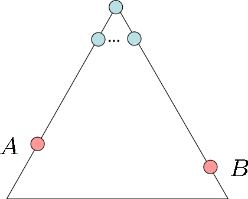
]
]

---

# Optimality of A* (tree search)

.grid[
.col-2-3[
- Assume $B$ is on the fringe.
- Some ancestor $n$ of $A$ is on the fringe too.
- *Claim*: $n$ will be expanded before $B$.
    - $f(n) \leq f(A)$
        - $f(n) = g(n) + h(n)$ (by definition)
        - $f(n) \leq g(A)$ (admissibility of $h$)
        - $g(A) = f(A)$ ($h=0$ at a goal)
    - $f(A) < f(B)$
        - $g(A) < g(B)$ ($B$ is suboptimal)
        - $f(A) < f(B)$ ($h=0$ at a goal)
    - $n$ expands before $B$
        - since $f(n) \leq f(A) < f(B)$
- All ancestors of $A$ expand before $B$, including $A$. Thefore **A* is optimal**.

]
.col-1-3[
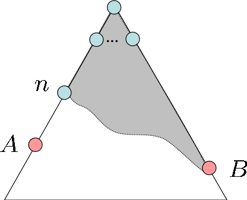
]
]

---

# A* contours

- $f$-costs are non-decreasing along any path.
- We can define **contour levels** $t$ in the state space, that include all nodes for which $f(n) \leq t$.

.center[
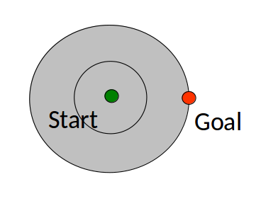
]
.grid[
.col-1-2[
For UCS ($h(n)=0$), bands are circular around the start.
]
.col-1-2[
For A* with accurate heuristics, bands stretch towards the goal.
]
]

---

# Comparison

.grid[
.col-1-3[

]
.col-1-3[

]
.col-1-3[

]
]
.center.grid[
.col-1-3[
Greedy search
]
.col-1-3[
UCS
]
.col-1-3[
A*
]
]

.footnote[Credits: UC Berkeley, [CS188](http://ai.berkeley.edu/lecture_slides.html)]

---

# Creating admissible heuristics

- Most of the work in solving hard search problems optimally is in finding admissible heuristics.
- Admissible heuristics can be derived from the exact solutions to *relaxed problems*, where new actions are available.
.center.width-70[]

---

# Dominance

- If $h_1$ and $h_2$ are both admissible and if $h_2(n) \geq h_1(n)$ for all $n$, then $h_2$ **dominates** $h_1$ and is *better* for search.
- Given any admissible heuristics $h_a$ and $h_b$, $$h(n) = \max(h_a(n), h_b(n))$$ is also admissible and dominates $h_a$ and $h_b$.

---

# Redundant paths

The failure to detect **repeated states** can turn a linear problem into an exponential one!

.stretch[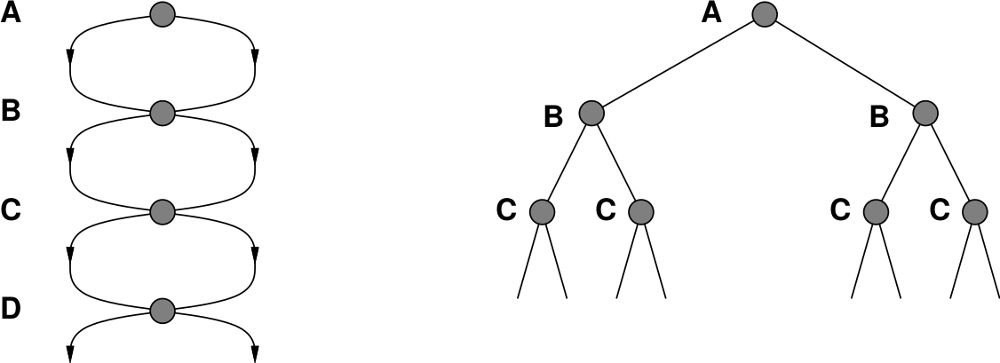]

---

# Graph search

Redundant paths and cycles can be avoided by **keeping track** of the states that have been *explored*.
This amounts to grow a tree directly on the state-space graph.

.stretch[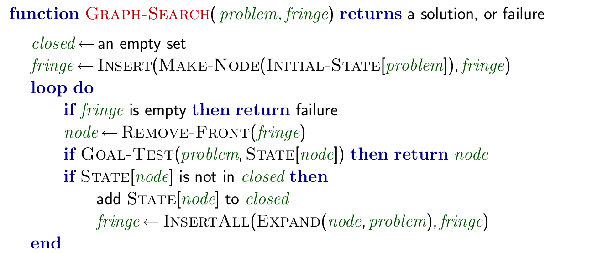]

[Q] What are the properties of DFS/GFS/UCS/GS/A* based on graph search?

---

---

# Summary

- Problem formulation usually requires **abstracting away real-world details** to define a state space that can feasibly be explored.
- Variety of uninformed search strategies (*DFS*, *BFS*, *UCS*, *Iterative deepening*)
- **Heuristic functions** estimate costs of shortest paths.
- Good heuristic can dramatically *reduce search cost*.
- **Greedy best-first search** expands lowest $h$.
    - *incomplete* and *not always optimal*.
- **A*** search expands lower $f=g+h$
    - *complete* and *optimal*
- Admissible heuristics can be derived from exact solutions of relaxed problems.
- *Graph search* can be exponentially more efficient than tree search.

---

# References
