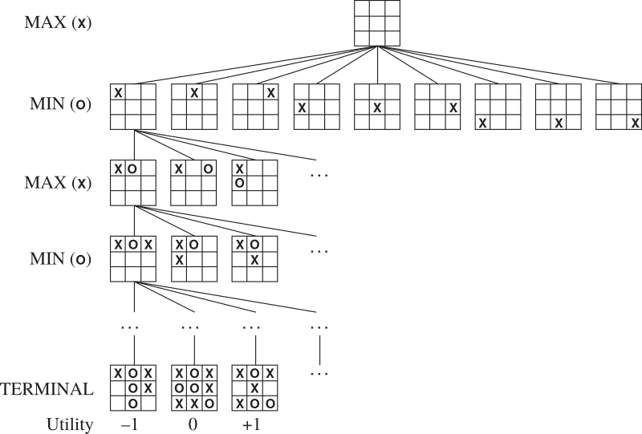
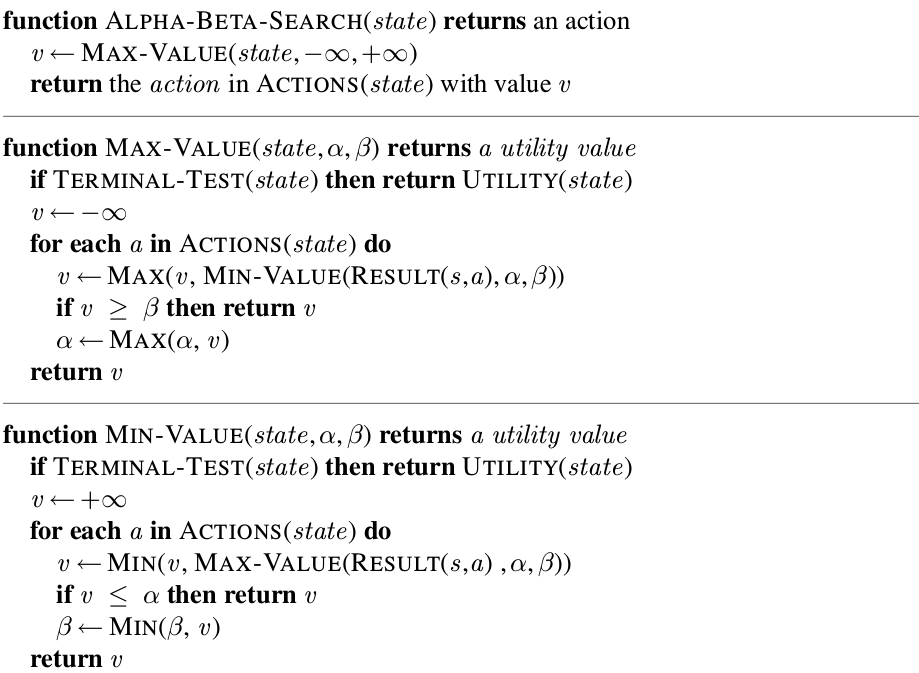
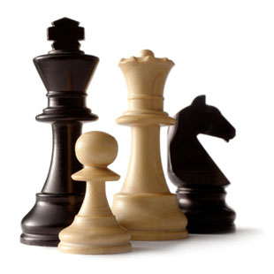

class: middle, center, title-slide

# Introduction to Artificial Intelligence

Lecture 3: Games

---

# Today

---

class: center

# Ignore the Blonde

<iframe width="560" height="315" src="https://www.youtube.com/embed/LJS7Igvk6ZM" frameborder="0" allowfullscreen></iframe>

---

# Games

- A **game** is a multi-agent environment where agents may have either *conflicting* or *common* interests.
- Opponents may act **arbitrarily**, even if we assume a deterministic fully observable environment.
    - Therefore the solution to a game is a *strategy* specifying a move for every possible opponent reply.
    - This is different from search where a solution is a *fixed* sequence.
- Time **limits**.
    - Branching factor is often very large.
    - Unlikely to find goal with standard search algorithms, we need to *approximate*.

---

# Types of games

- **Deterministic** or *stochastic*?
- **Perfect** or *imperfect* information?
- **One**, *two or more* players?

---

# Formal definition

A **game** is formally defined as kind of search problem with the following components:
- The *initial state* $s_0$ of the game.
- A function $\text{player}(s)$ that defines which *player* $p \in \\{1, ..., N \\}$ has the move in state $s$.
- A description of the legal *actions* (or *moves*) available to a state $s$, denoted $\text{actions}(s)$.
- A *transition model* that returns the state $s' = \text{result}(s, a)$ that results from doing action $a$ in state $s$.
- A *terminal test* which determines whether the game is over.

---

- A *utility function* $\text{utility}(s, p)$ (or payoff) that defines the final numeric value for a game that ends in $s$ for a player $p$.
    - E.g., $1$, $0$ or $\frac{1}{2}$ if the outcome is win, loss or draw.
- Together, the initial state, the $\text{actions}(s)$ function, the $\text{result}(s, a)$ function and the terminal test define the **game tree**.
    - *Nodes* are game states.
    - *Edges* are actions.

## Assumptions

- We assume *deterministic*, *turn-taking*, *two-player* **zero-sum games** of *perfect information*.
- We will call our two players **MAX** and *MIN*. **MAX** moves first.

.center.width-50[]

.footnote[Credits: UC Berkeley, [CS188](http://ai.berkeley.edu/lecture_slides.html)]

---

# Game tree

.width-100[]

---

# Zero-sum games

- In a **zero-sum** game, the total payoff to all players is *constant* for all games.
    - E.g., $0+1$, $1+0$ or $\frac{1}{2} + \frac{1}{2}$.
- For two-player games, agents share the **same utility** function, but one wants to *maximize* it while the other wants to *minimize* it.
    - MAX maximizes the game's $\text{utility}$ function.
    - MIN minimizes the game's $\text{utility}$ function.
- *Strict competition*.
    - If one wins, the other loses, and vice-versa.

.center.width-40[]

.footnote[Credits: UC Berkeley, [CS188](http://ai.berkeley.edu/lecture_slides.html)]

---

# Adversarial search

.grid[
.col-2-3[
- In a search problem, the optimal solution is a sequence of actions leading to a goal state.
    - i.e., a terminal state where MAX wins.
- In a game, the opponent (MIN) may react *arbitrarily* to a move.
- Therefore, a player (MAX) must define a contingent **strategy** which specifies
    - its moves in the initial state,
    - its moves in the states resulting from every possible response by MIN,
    - its moves in the states resulting from every possible response by MIN in those states,
    - ...
]
.col-1-3[

]
]

[Q] What is an optimal strategy? How do we find it?

.footnote[Credits: UC Berkeley, [CS188](http://ai.berkeley.edu/lecture_slides.html)]

---

# Minimax

The **minimax value** $\text{minimax}(s)$ is the largest achievable payoff (for MAX) from state $s$, assuming an optimal adversary (MIN).

.center.width-100[]

The **optimal** next move (for MAX) is to take the action that maximizes the minimax value in the resulting state.
- Assuming that MIN is an optimal adversary maximizes the *worst-case outcome* for MAX.
- This is equivalent to not making an assumption about the strength of the opponent.

---

# Minimax example

.width-100[]

---

# Properties of Minimax

- *Completeness*:
    - Yes, if tree is finite.
- *Optimality*:
    - Yes, if MIN is an optimal opponent.
    - What if MIN is suboptimal?
        - Show that MAX will do even better.
    - What if MIN is suboptimal and predictable?
        - Other strategies might do better than Minimax. However they will do worse on an optimal opponent.

---

# Minimax efficiency

- Assume $\text{minimax}(s)$ is implemented using its recursive definition.
- How *efficient* is minimax?
    - Time complexity: same as DFS, i.e., $O(b^m)$.
    - Space complexity:
        - $O(bm)$, if all actions are generated at once, or
        - $O(m)$, if actions are generated one at a time.

[Q] Do we need to explore the whole game tree?

---

# Pruning

.center.width-80[]

.width-100[]

Therefore, it is possible to compute the **correct** minimax decision *without looking at every node* in the tree.

---

# Pruning

.center.width-80[]

---

class: smaller

# $\alpha$-$\beta$  pruning

We want to compute $v = \text{minimax}(n)$ (for MIN).
- We loop over $n$'s children.
- The minimax values are being computed one at a time and $v$ is updated iteratively.
- Let $\alpha$ be the best value that MAX can get, at any choice point along the current path from root.
- If $v$ becomes lower than $\alpha$, then **MAX will avoid it**.
- Therefore, we can *stop iterating* over the remaining $n$'s other children.

.center.width-30[]

---

# $\alpha$-$\beta$  search

.width-100[]

---

# Properties of $\alpha$-$\beta$ search

- Pruning has **no effect** on the minimax values. Therefore, *completeness* and *optimality* are preserved from Minimax.
- *Time complexity*:
    - The effectiveness depends on the order in which the states are examined.
    - If states could be examined in *perfect order*, then $\alpha-\beta$ search examines only $O(b^{m/2})$ nodes to pick the best move, vs. $O(b^m)$ for minimax.
        - $\alpha-\beta$ can solve a tree twice as deep as minimax can in the same amount of time.
        - Equivalent to have an effective branching factor $\sqrt{b}$.
- *Space complexity*: $O(m)$, as for Minimax.

---

# Game tree size

.center.width-30[]

Chess:
- $b \approx 35$ (approximate average branching factor)
- $d \approx 100$ (depth of a game tree for typical games)
- $b^d \approx 35^{100} \approx 10^{154}$.
- For $\alpha-\beta$ search and perfect ordering, we get $b^{d/2} \approx 35^{50} = 10^{77}$.

Finding the exact solution is completely **infeasible**.

---

# Imperfect real-time decisions

???

Depth matters => show videos

---

# Stochastic games

---

# Partially observable games

---

# State-of-the-art game programs

---

# Monte Carlo tree search

---

# Summary

---

# References
