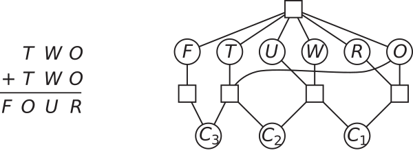
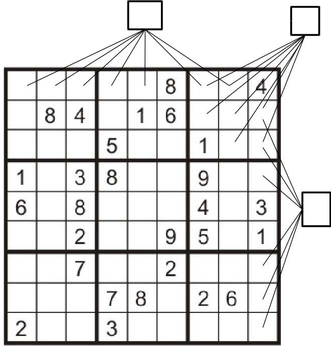
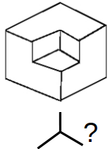
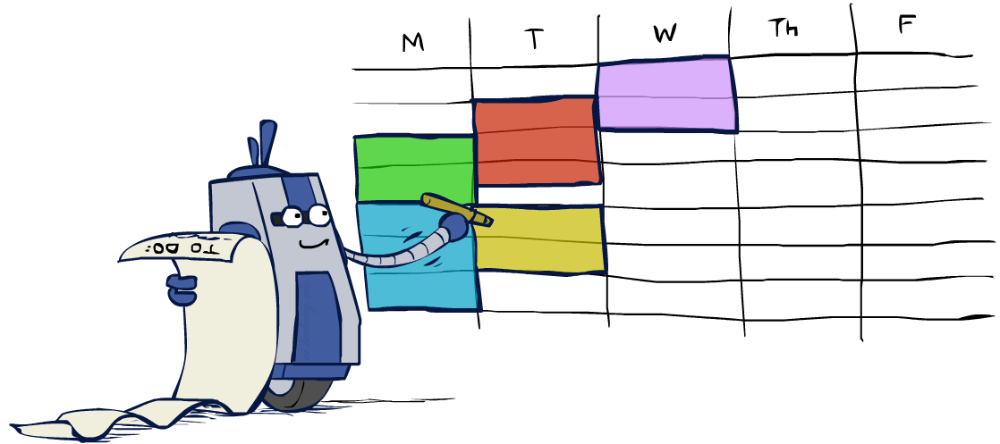
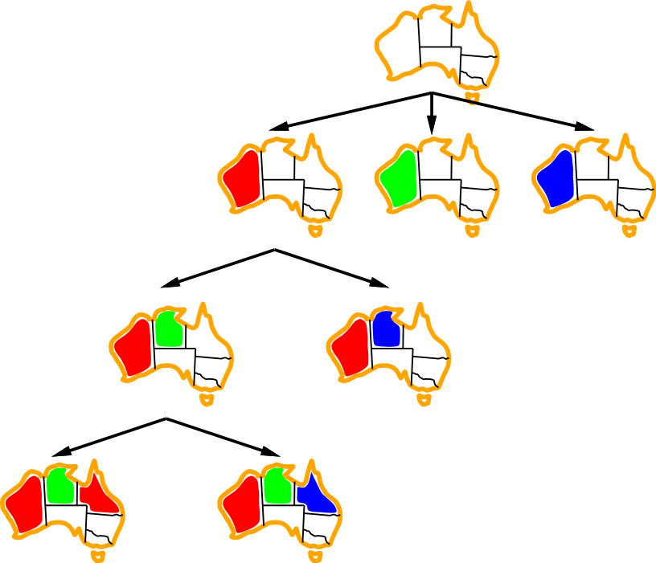
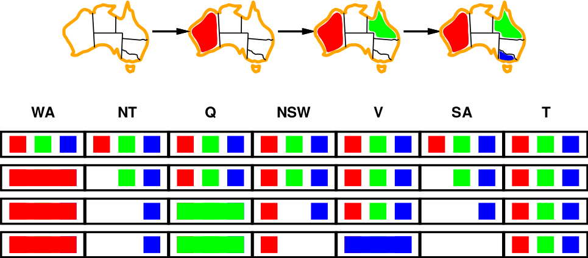

class: middle, center, title-slide

# Introduction to Artificial Intelligence

Lecture 4: Constraint satisfaction problems

---

# Today

---

class: middle, center

# Constraint satisfaction problems

---

# Motivation

- In *standard search problems*:
    - States are evaluated by domain-specific heuristics.
    - States are tested by a domain-specific function to determine if the goal is achieved.
    - From the point of view of the search algorithms however, **states are atomic**.
        - A state is a black box.
- Instead, if states have *a factored representation*, then the structure of states can be exploited to improve the *efficiency of the search*.
- **Constraint satisfaction problem** algorithms *take advantage of this structure* and use *general-purpose* heuristics to solve complex problems.
- Main idea: eliminate large portions of the search space all at once, by identifying combinations of variable/value that violate constraints.

---

# Constraint satisfaction problems

Formally, a constraint satisfaction problem (CSP) consists of three components $X$, $D$ and $C$:

- $X$ is a set of variables, $\\{X_1, ..., X_n\\}$,
- $D$ is a set of domains, $\\{D_1, ..., D_n\\}$, one for each variable,
- $C$ is a set of constraints that specify  allowable combinations of values.

---

# Example: Map coloring

.center.width-80[]

---

# Example: Map coloring

.center.width-30[]

- Variables: $X = \\{ WA, NT, Q, NSW, V, SA, T \\}$
- Domains: $D_i = \\{ red, green, blue \\}$ for each variable.
- Constraints: $C = \\{ SA \neq WA, SA \neq NT, SA\neq Q, ... \\}$
    - Implicit: $WA \neq NT$
    - Explicit: $(WA, NT) \in \\{ \\{red, green\\}, \\{red, blue\\}, ... \\}$
- Solutions are **assignments** of values to the variables such that constraints are all satisfied.
    - e.g., $\\{ WA=red, NT=green, Q=red, SA=blue,$ $\quad\quad NSW=green, V=red, T=green \\}$

---

# Constraint graph

.center.width-50[]

- *Nodes* = variables of the problems
- *Edges* = constraints in the problem involving the variables associated to the end nodes.
- General purpose CSP algorithms **use the graph structure** to speedup search.
    - e.g., Tasmania is an independent subproblem.

---

# Example: Cryptarithmetic

.center.width-60[]

- Variables: $\\{ T, W, O, F, U, R, C_1, C_2, C_3\\}$
- Domains: $D_i = \\{ 0, 1, 2, 3, 4, 5, 6, 7, 8, 9 \\}$
- Constraints:
    - $\text{alldiff}(T, W, O, F, U, R)$
    - $O+O=R+10\times C_1$
    - $C_1 + W + W = U + 10\times C_2$
    - ...

---

# Example: Sudoku

.center.width-30[]

- Variables: each (open) square
- Domains: $D_i = \\{ 1, 2, 3, 4, 5, 6, 7, 8, 9 \\}$
- Constraints:
    - 9-way $\text{alldiff}$ for each column
    - 9-way $\text{alldiff}$ for each row
    - 9-way $\text{alldiff}$ for each region
---

# Example: The Waltz algorithm

.center.width-40[]

The Waltz algorithm is a procedure for interpreting 2D line drawings of solid polyhedra as 3D objects. Early example of an AI computation posed as a CSP.

.pull-right.width-70[]
CSP formulation:
- Each intersection is a variable.
- Adjacent intersections impose constraints on each other.
- Solutions are physically realizable 3D objects.

.footnote[Credits: UC Berkeley, [CS188](http://ai.berkeley.edu/lecture_slides.html)]

---

# Variations on the CSP formalism

- *Discrete variables*
    - Finite domains
        - Size $d$ means $O(d^n)$ complete assignments.
        - e.g., boolean CSPs, including the SAT boolean satisfiability problem (NP-complete).
    - Infinite domains
        - e.g., job scheduling, variables are start/end days for for each job.
        - need a constraint language, e.g. $start_1 + 5 \leq start_2$.
        - Solvable for linear constraints, undecidable otherwise.
- *Continuous variables*
    - e.g., precise start/end times of experiments on the Hubble Space telescope (that must obey astronomical and power constraints).
    - Linear constraints solvable in polynomial time by LP methods.

---

# Variations on the CSP formalism

- *Varieties of constraints*:
    - Unary constraint involve a single variable.
        - Equivalent to reducing the domain, e.g. $SA \neq green$.
    - Binary constraints involve pairs of variables, e.g. $SA \neq WA$.
    - Higher-oder constraints involve 3 or more variables.
- *Preferences* (*soft constraints*)
    - e.g., red is better than green.
    - Often representable by a cost for each variable assignment.
    - Results in constraint optimization problems.
    - (We will ignore those for now.)

---

# Real-world examples

.grid[
.col-1-2[
- Assignment problems
    - e.g., who teaches what class
- Timetabling problems
    - e.g., which class is offered when and where?
- Hardware configuration
- Spreadsheets
- Transportation scheduling
- Factory scheduling
- Circuit layout
- ... and many more
]
.col-1-2[

]
]

Notice that many real-world problems involve real-valued variables.

.footnote[Credits: UC Berkeley, [CS188](http://ai.berkeley.edu/lecture_slides.html)]

---

class: middle, center

# Solving CSPs

---

# Standard search formulation

- CSPs can be cast as standard search problems.
    - For which we have solvers, including DFS, BFS or A*.
- States are partial assignments:
    - The *initial state* is the empty assignment $\\{ \\}$.
    - *Actions*: assign a value to an unassigned variable.
    - *Goal test*: the current assignment is complete and satisfies all constraints.
- This algorithm is the same for all CSPs!

---

# Search methods

.center.width-50[]

- What would BFS or DF do? What problems does naive search have?
- For $n$ variables of domain size $d$, $b=(n-l)d$ at depth $l$.
    - We generate a tree with $n!d^n$ leaves even if there are only $d^n$ possible assignments!

XXX: video?

---

# Backtracking search

- Backtracking search is the basic uninformed algorithm for solving CSPs.
- Idea 1: **One variable at a time**:
    - The naive application of search algorithms ignore a crucial property: variable assignments are *commutative*. Therefore, fix the ordering.
        - $WA=red$ then $NT=green$ is the same as $NT=green$ then $WA=red$.
    - One only needs to consider assignments to a single variable at each step.
        - $b=d$ and there are $d^n$ leaves.
- Idea 2: **Check constraints as you go**:
    - Consider only values which do not conflict with current partial assignment.
    - Incremental goal test.

---

# Backtracking example

.center.width-80[]

---

# Backtracking search

.center.width-100[]

- Backtracking = DFS + variable-ordering + fail-on-violation
- What are the choice points?

---

# Improving backtracking

- Can we improve backtracking using **general-purpose** ideas, without domain-specific knowledge?
- *Ordering*:
    - Which variable should be assigned next?
    - In what order should its values be tried?
- *Filtering*: can we detect inevitable failure early?
- *Structure*: can we exploit the problem structure?

---

# Variable ordering

- **Minimum remaining values**:
Choose the variable *with the fewest legal values left* in its domain.
- Also known as the *fail-first* heuristic.
    - Detecting failures quickly is equivalent to pruning large parts of the search tree.

.center.width-100[]

---

# Value ordering

- **Least constraining value**: Given a choice of variable, choose the *least constraining value*.
- i.e., the value that rules out the fewest values in the remaining variables.

.center.width-100[]

[Q] Why should variable selection be fail-first but value selection be fail-last?

---

# Filtering: Forward checking

- Keep *track of remaining legal values* for unassigned variables.
    - Whenever a variable $X$ is assigned, and for each unassigned variable $Y$ that is connected to $X$ by a constraint, delete from $Y$'s domain any value that is inconsistent.
- *Terminate search* when any variable has no legal value left.

.center.width-100[]

---

# Filtering: Constraint propagation

---

# Structure

---

class: middle, center

# First-order logic as a CSP

---

# First-order logic

---

# Summary

---

# References
