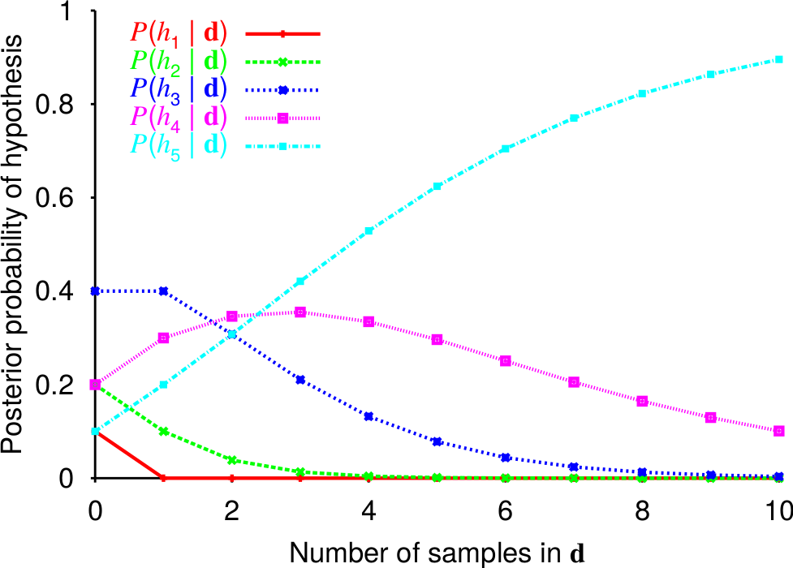
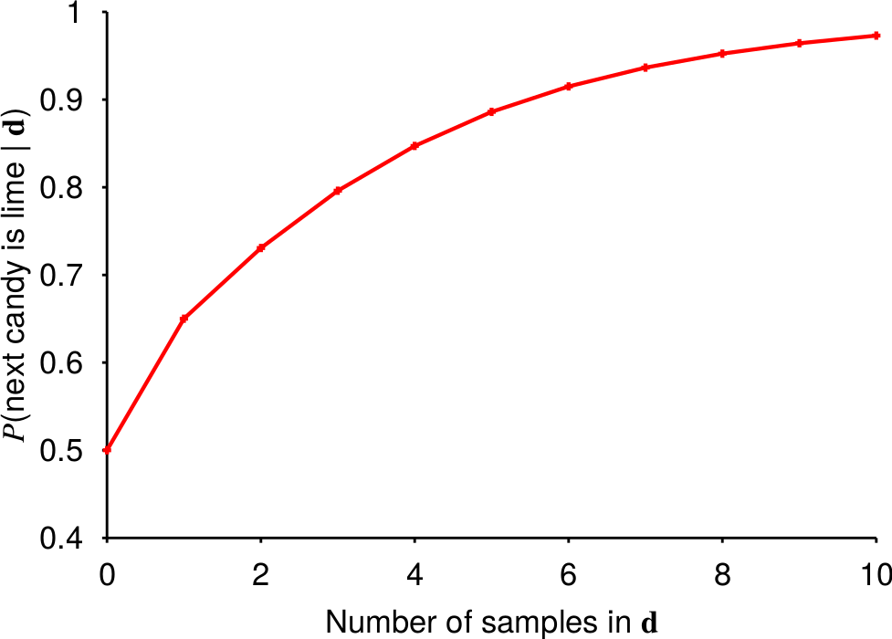
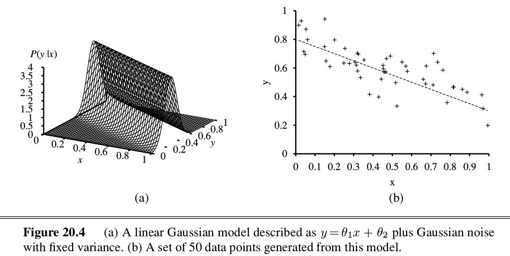

class: middle, center, title-slide

# Introduction to Artificial Intelligence

Lecture 8: Learning

---

# Today

- *Learning*
- *Statistical learning*
- *Supervised learning*
- *Reinforcement learning*
- *Unsupervised learning*

---

# Intelligence?

- What we covered so far...
    - Search algorithms, using a state space specified by domain knowledge.
    - Adversarial search, for known and fully observable games.
    - Constraint satisfaction problems, by exploiting a known structure of the states.
    - Logical inference, using well-specified facts and inference rules.
    - Reasoning about uncertain knowledge, as represented using domain-motivated graphs.
- Enough to implement complex and rational behaviors, *in some situations*.
- But is that **intelligence**? Aren't we missing something?

---

# Chomsky vs. Piaget

.grid[
.col-2-3[
- *Noam Chomsky* (innatism):
    - State that humans possess a genetically determined faculty for thought and language.
    - The structures of language and thought are set in motion through interaction with the environment.
- *Jean Piaget* (constructivism):
    - Deny the existence of innate cognitive structure specific for thought and language.
    - Postulate instead all cognitive acquisitions, including language, to be the outcome of a gradual process of construction, i.e., a learning procedure.
]
.col-1-3[]
]

[Q] What about AI? Should it be a pre-wired efficient machine? Or a machine that can learn and improve? or maybe a bit of both?

---

# The debate continues...

.center[
<iframe width="640" height="480" src="https://www.youtube.com/embed/aCCotxqxFsk?&loop=1&start=0" frameborder="0" volume="0" allowfullscreen></iframe>
]

---

# Learning

- What if the environment is *unknown*?
- **Learning** can be used as a system construction method.
    - i.e., expose the agent to reality rather trying to hardcode reality into the agent's program.
- Learning can be used as an *automated way* to modify the agent's decision mechanisms to improve performance.

---

# Learning agents

.center.width-100[]

---

# Learning element

- The design of the **learning element** is dictated by:
    - What type of performance element is used.
    - Which functional component is to be learned.
    - How that functional component is represented.
    - What kind of feedback is available.
- Examples:    

.center.width-70[]
- The nature and frequency of the feedback often determines a learning strategy:
    - *Supervised learning*: correct answer for each instance.
    - *Reinforcement learning*: occasional rewards.
    - *Unsupervised learning*: no feedback!

---

class: middle, center,

# Statistical learning

---

# Learning probabilistic models

- Agents can handle uncertainty by using a **specified** probabilistic model of the world.
- This model may then be combined with decision theory to take actions.
- In lack of a good probabilistic model, what should an agent do?
- **Learn** it from experience with the world!

---

# Bayesian learning

- View **learning as Bayesian updating** of probability distribution over the *hypothesis space*.
    - $H$ is the hypothesis variable, values are $h\_1$, $h\_2$, ... and the prior is $P(H)$.
    - $\mathbf{d}$ is the observed data.
- Given the data so far, each hypothesis has a posterior probability $$P(h\_i|\mathbf{d}) = \alpha P(\mathbf{d}|h\_i) P(h\_i)$$ where $P(\mathbf{d}|h\_i)$ is called the *likelihood*.
- Predictions use a likelihood-weighted average over the hypotheses:
$$P(X|\mathbf{d}) = \sum\_i P(X|\mathbf{d}, h\_i) P(h\_i | \mathbf{d}) = P(X|h\_i) P(h\_i | \mathbf{d})$$
- No need to pick one best-guess hypothesis!

---

# Example

- Suppose there are five kinds of bags of candies. Assume a prior $P(H)$:
    - $P(h\_1)=0.1$, with $h\_1$: 100% cherry candies
    - $P(h\_2)=0.2$, with $h\_2$: 75% cherry candies + 25% lime candies
    - $P(h\_3)=0.4$, with $h\_3$: 50% cherry candies + 50% lime candies
    - $P(h\_4)=0.2$, with $h\_4$: 25% cherry candies + 75% lime candies
    - $P(h\_5)=0.1$, with $h\_5$: 100% lime candies

.center.width-70[]
- Then we observe candies drawn from som bag:

.center.width-40[]
- What kind of bag is it? What flavour will the next candy be?

---

# Posterior probability of hypotheses

.center.width-70[]

---

# Prediction probability

.center.width-70[]

- This example illustrates the fact that the Bayesian prediction *eventually agrees with the true hypothesis*.
- The posterior probability of any false hypothesis eventually vanishes.

---

# MAP approximation

- Summing over the hypothesis space is often *intractable*.
    - e.g., there are $2^{2^n}$ $n$-ary boolean functions of boolean inputs.
- **Maximum a posteriori** (MAP) learning:
$$h\_{MAP} = \arg \max\_{h\_i} P(h\_i | \mathbf{d})$$
- That is, maximize $P(\mathbf{d}|h\_i) P(h\_i)$ or $\log P(\mathbf{d}|h\_i) + \log P(h\_i)$.
    - Log terms can be be viewed as (negative of) *bits to encode data given hypothesis* + *bits to encode hypothesis*.
    - This is the basic idea of minimum description length learning, i.e., Occam's razor.
- Finding the MAP hypothesis is often much easier than Bayesian learning, since it requires solving an optimization problem instead of a large summation problem.
- For deterministic hypotheses, $P(\mathbf{d}|h\_i)=1$ if $h\_i$ is consistent, and $0$ otherwise.
    - Therefore, MAP yields the simplest consistent hypothesis.

---

# Maximum likelihood

- For large data sets, the prior $P(H)$ becomes irrelevant.
- **Maximum likelihood estimation** (MLE):
$$h\_{MLE} = \arg \max\_{h\_i} P(\mathbf{d} | h\_i)$$
- That is, simply get the best fit to the data.
    - Identical to MAP for uniform prior.
- MLE is the standard (non-Bayesian) statistical learning method.

---

# Parameter learning BNs

.center.width-100[]

---

# MLE, case (a)

- Bag from a new manufacturer; fraction $\theta$ of cherry candies?
    - Any $\theta$ is possible: continuum of hypotheses $h\_\theta$.
    - $\theta$ is a **parameter** for this simple binomial family of models.
- Suppose we unwrap $N$ candies, and get $c$ cherries and $l=N-c$ limes.
- These are *i.i.d.* observations, so:
$$P(\mathbf{d}|h\_\theta) = \prod\_{j=1}^N P(d\_j | h\_\theta) = \theta^c (1-\theta)^l$$
- Maximize this w.r.t. $\theta$, which is easier for the *log-likelihood*:
    - $L(\mathbf{d}|h\_\theta) = \log P(\mathbf{d}|h\_\theta) = c \log \theta + l \log(1-\theta)$
    - $\frac{d L(\mathbf{d}|h\_\theta)}{d \theta} = \frac{c}{\theta} - \frac{l}{1-\theta}=0$, therefore $\theta=\frac{c}{N}$.
    - Seems *sensible*, but causes problems with $0$ counts!
---

# MLE, case (b)

- Red/green wrapper depends probabilistically on flavor.
- Likelihood for e.g. a cherry candy in green wrapper:
  
$P(F=cherry, W=green|h\_{\theta,\theta\_1, \theta\_2})$ 
$= P(F=cherry|h\_{\theta,\theta\_1, \theta\_2}) P(W=green|F=cherry, h\_{\theta,\theta\_1, \theta\_2})$ 
$= \theta (1-\theta\_1)$
- The likelihood for the data, given $N$ candies, $r\_c$ red-wrapped cherries, $g\_c$ green-wrapped cherries, etc. is:
  
$P(\mathbf{d}|h\_{\theta,\theta\_1, \theta\_2}) = \theta^c (1-\theta)^l \theta\_1^{r\_c}(1-\theta\_1)^{g\_c} \theta\_2^{r\_l} (1-\theta\_2)^{g\_l}$
  
$L = c \log \theta + l \log(1-\theta) $ 
$\,\,\,\,+ r\_c \log \theta\_1 + g\_c \log(1-\theta\_1)$ 
$\,\,\,\,+ r\_l \log \theta\_2 + g\_l \log(1-\theta\_2)$

---

# MLE, case (b), cont.

- Derivatives of $L$ contain only the relevant parameter:
    - $\frac{\partial L}{\partial \theta} = \frac{c}{\theta} - \frac{l}{1-\theta} = 0 \quad\Rightarrow\quad \theta = \frac{c}{c+l}$
    - $\frac{\partial L}{\partial \theta\_1} = \frac{r\_c}{\theta\_1} - \frac{g\_c}{1-\theta\_1} = 0 \quad\Rightarrow\quad \theta\_1 = \frac{r\_c}{r\_c + g\_c}$
    - $\frac{\partial L}{\partial \theta\_2} = \frac{r\_l}{\theta\_2} - \frac{g\_l}{1-\theta\_2} = 0 \quad\Rightarrow\quad \theta\_2 = \frac{r\_l}{r\_l + g\_l}$
- Again, results coincide with intuition.
- This can be extended to any Bayesian network with parameterized CPTs.
- Importantly, with *complete data*, maximum likelihood parameter learning for a Bayesian network **decomposes into separate learning problems**, one for each parameter.

---

# MLE for linear Gaussian models

.center.width-70[]

- Assume a **parameterized** *linear Gaussian model* with one continuous parent $X$ and one continuous child $Y$.
- To learn the conditional distribution $P(Y|X)$, we maximize
$$P(y|x) = \frac{1}{\sqrt{2\pi}\sigma} \exp(-\frac{(y-(\theta\_1 x + \theta\_2))^2}{2\sigma^2})$$
w.r.t. $\theta\_1$ and $\theta\_2$ over the data $\mathbf{d}$.

---

# MLE for linear Gaussian models

- Constraint the derivatives of the log-likelihood to 0 and simplify. We arrive to the problem of minimizing
$$\sum\_{j=1}^N (y\_j - (\theta\_1 x\_j + \theta\_2))^2$$
- That is, minimizing the sum of squared errors corresponds to MLE solution for a linear fit, *assuming Gaussian noise of fixed variance*.
- This is also known as **linear regression**.

[Q] Can you derive the equivalence?

---

# Recap

- Full Bayesian learning gives best possible predictions but is intractable.
- MAP learning **balances complexity with accuracy** on training data.
- Maximum likelihood *assumes uniform prior*, OK for large data sets.
    - Choose a parameterized family of models to describe the data.
        - requires substantial insight and sometimes new models.
    - Write down the likelihood of the data as a function of the parameters.
        - may require summing over hidden variables, i.e., inference.
    - Write down the derivative of the log likelihood w.r.t. each parameter.
    - Find the parameter values such that the derivatives are zero.
        - may be hard/impossible; modern optimization techniques help.

---

# Going further

- When some variables are hidden, local maximum likelihood solutions can be found using the **EM algorithm**.
- Learning the structure of Bayesian networks is also possible. This is an example of *model selection* and usually involves a discrete search in the space of structures.
- *Non-parametric* models represent a distribution using the collection of data points.
Thus, the number of parameters grows with the training set.

---

class: middle, center,

# Supervised learning

---

# Supervised learning

---

# Feature vectors

---

# Linear classifiers

connect to MLE!!!

---

# Binary decision rules

---

# Perceptron

---

# Multiclass decision rules

---

# Properties of perceptrons

---

# Apprenticeship

---

# Multi-layer perceptron

---

# Backpropagation

---

# Deep Learning

compositional
demo pliage
apprentissage de concepts non-programmés

---

class: middle, center

# Reinforcement learning

---

# Reinforcement learning

learning by interaction

---

class: middle, center

# Unsupervised learning

---

# Unsupervised learning

learning by observation

---

# Summary

---

# References
